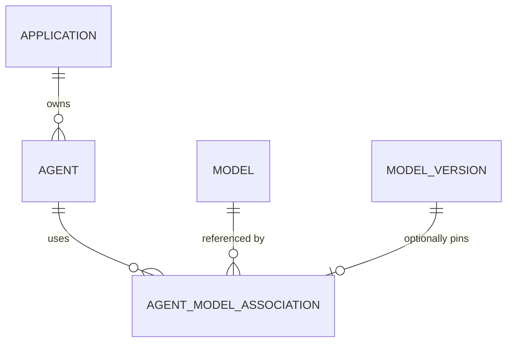

# Application / Agent Association (Feature 4)

Backend-only feature registering the applications and AI agents Auditra governs, and the inventory links from each agent to the models it uses. It records relationships; it never invokes a model or runs an agent.

## 1. Purpose

Close the gap between "these models exist" and "this agent actually uses them". Governance questions — which agent depends on which model, which application owns that agent, what happens if a model is retired — require a queryable Application → Agent → Model chain. This feature provides that chain plus reverse lookup: given a model, list every agent that references it.

## 2. Scope

In scope (V1):

- Application records (create, read, update, archive) scoped to a tenant.
- Agent records under an application (create, read, update, archive).
- Agent ↔ Model association records with role, priority, optional model version, configuration, and lifecycle (`ACTIVE`/`DISABLED`).
- Reverse lookup `GET /api/v1/models/{model_id}/agents`.
- Filtering, sorting, pagination on every list endpoint.
- PostgreSQL persistence via SQLAlchemy 2 + Alembic migration `0004_application_agent_association`.

Out of scope (V1): authentication/authorization middleware, frontend, model usage, model discovery, connector ingestion, Redis, LangGraph as a runtime dependency (agents are inventory records; `framework` is metadata). Auditra never calls a model or executes an agent.

## 3. Architecture

Layering follows the existing model-inventory module:

```text
API (FastAPI, app/modules/model_inventory/api/{applications,agents,agent_models}.py)
  -> Services (ApplicationService, AgentService, AgentAssociationService)
    -> Repositories (application_repository, agent_repository,
                     agent_model_association_repository)
      -> ORM (Application, Agent, AgentModelAssociation) -> PostgreSQL (alembic 0004)
  -> Domain (status transition matrix, errors, events)
  -> Schemas (Pydantic request/response, slug normalization, metadata validation)
```

- The router only parses/validates HTTP input, calls one service method, and maps the ORM row to a response schema.
- Services own every business rule: slug uniqueness, archive guards, association duplicate rules, model/version validation, status transitions, event dispatch.
- Repositories are tenant-scoped query builders; `IntegrityError` is mapped to a domain 409 on commit.
- Domain events (`application.created/updated/archived`, `agent.created/updated/archived`, `agent_model_association.created/updated/disabled`) are frozen dataclasses dispatched in-process after commit.

## 4. Domain model

- **Application** — a product/system that owns agents. UUID PK, `tenant_id`, unique `slug` per tenant, display fields (`display_name`, `description`, `application_type`, `owner_name`, `team_name`), `status`, `source`, `tags`, JSONB `metadata`, `archived_at`, timestamps, ownership columns.
- **Agent** — one AI agent belonging to exactly one application (`application_id`, FK RESTRICT). Fields: `name`, unique `slug` per application, `agent_type`, free-form lowercased `framework` (`langgraph`, `autogen`, `custom`, ...), `framework_version`, `runtime_identifier`, ownership fields, `status`, `source`, JSONB `capabilities`, `tags`, `metadata`, `archived_at`.
- **AgentModelAssociation** — one link from an agent to a model: `agent_id` and `model_id` (both FK RESTRICT), optional `model_version_id` (FK RESTRICT, must belong to `model_id`), `role`, `selection_priority`, `status`, `source`, JSONB `configuration` + `metadata`, `disabled_at`.
- **Association role** — `PRIMARY, FALLBACK, EMBEDDING, RERANKER, VISION, MULTIMODAL, MODERATION, OTHER` (validated, uppercased).
- **Association source** — `manual, api, connector, discovery, system` (lowercased), defaults to `manual`.



## 5. Application and agent lifecycle

Statuses: `ACTIVE, INACTIVE, ARCHIVED` (`domain/lifecycle.py` `STATUS_ALLOWED_TRANSITIONS`).

| From     | To                  |
|----------|---------------------|
| ACTIVE   | INACTIVE, ARCHIVED  |
| INACTIVE | ACTIVE, ARCHIVED    |
| ARCHIVED | (none)              |

- Create accepts only `ACTIVE`/`INACTIVE`; illegal transitions return 409 `INVALID_STATUS_TRANSITION`.
- `ARCHIVED` is terminal; archive (DELETE) is idempotent, returns 204, sets `archived_at`.
- An archived application rejects new agents (409 `APPLICATION_ARCHIVED`).
- An archived/inactive agent rejects new **active** associations (409 `AGENT_NOT_ACTIVE`); its existing associations remain queryable.

## 6. Association rules (uniqueness invariants)

An association is a governance claim, so two rules hold for `ACTIVE` rows only (spec §FR-06, §FR-07):

1. Per agent, a given (`role`, `selection_priority`) pair is unique — e.g. only one `PRIMARY` at priority 1. A different role may share the same priority (`PRIMARY` + `EMBEDDING` both at 1).
2. Per agent, a given (`model_id`, `role`) pair is unique — the same model cannot fill the same role twice for one agent.

Enforced twice: service checks (`find_duplicate_role_priority` / `find_duplicate_model_role`) return 409 `ASSOCIATION_DUPLICATE`, backed by partial unique indexes `uq_agent_model_associations_agent_role_priority` and `uq_agent_model_associations_agent_model_role` (`WHERE status = 'ACTIVE'`). `model_version_id` is deliberately excluded from both (SQL `NULL` semantics would make partial matching unreliable).

`DISABLED` rows keep history (`disabled_at`) and never block re-association: disable (DELETE) is idempotent, returns 204, and creating the same association again succeeds.

Model eligibility for a new **active** association: the model must exist in the tenant (404 `MODEL_NOT_FOUND`) and must not be `RETIRED` (409 `MODEL_NOT_ASSOCIABLE`); `DEPRECATED` models remain associable. A `model_version_id`, when given, must exist (404 `MODEL_VERSION_NOT_FOUND`) and belong to the referenced model (409 `MODEL_VERSION_BELONGS_TO_DIFFERENT_MODEL`).

## 7. Database schema

Migration `alembic/versions/0004_application_agent_association.py`:

- `applications` — UUID PK, `tenant_id`, `slug`, display/ownership columns, `status`, `source`, JSONB `tags` + `metadata` (column `metadata_`), `archived_at`, timestamps, ownership columns. Unique `uq_applications_tenant_slug (tenant_id, slug)`; indexes on `(tenant_id, status)` and `(tenant_id, created_at)`.
- `agents` — UUID PK, `tenant_id`, FK `application_id -> applications.id` (RESTRICT), identity/framework/ownership columns, `status`, `source`, JSONB `capabilities`/`tags`/`metadata`, `archived_at`, timestamps. Unique `uq_agents_tenant_application_slug (tenant_id, application_id, slug)`; indexes on `application_id`, `framework`, `(tenant_id, status)`.
- `agent_model_associations` — UUID PK, `tenant_id`, FK `agent_id -> agents.id` (RESTRICT), FK `model_id -> models.id` (RESTRICT), nullable FK `model_version_id -> model_versions.id` (RESTRICT), `role`, `selection_priority`, `status`, `source`, JSONB `configuration`/`metadata`, `disabled_at`, timestamps. Indexes on `(agent_id, status)`, `(model_id, status)`, `model_version_id`, `(tenant_id, created_at DESC)` plus the two partial unique indexes from §6.

All three tables are truncated (associations first) by the test suite's TRUNCATE list; no table uses a Postgres ENUM — `String` + `CheckConstraint` as everywhere else in the module.

## 8. API specification

All under `/api/v1` (OpenAPI at `/docs`):

```http
POST   /api/v1/applications                                # 201
GET    /api/v1/applications                                # filters, sort, page
GET    /api/v1/applications/{application_id}
PATCH  /api/v1/applications/{application_id}
DELETE /api/v1/applications/{application_id}               # 204 archive, idempotent

POST   /api/v1/applications/{application_id}/agents        # 201
GET    /api/v1/applications/{application_id}/agents
GET    /api/v1/agents                                      # cross-application list
GET    /api/v1/agents/{agent_id}
PATCH  /api/v1/agents/{agent_id}
DELETE /api/v1/agents/{agent_id}                           # 204 archive, idempotent

POST   /api/v1/agents/{agent_id}/models                    # 201 association
GET    /api/v1/agents/{agent_id}/models                    # role/status filters, active_only
GET    /api/v1/agents/{agent_id}/models/{association_id}
PATCH  /api/v1/agents/{agent_id}/models/{association_id}
DELETE /api/v1/agents/{agent_id}/models/{association_id}   # 204 disable, idempotent

GET    /api/v1/models/{model_id}/agents                    # reverse lookup
```

List endpoints share the envelope `{items, page, page_size, total, total_pages}` with `page ≥ 1`, `page_size 1–100` (default 25), `sort_order asc|desc`, and an allowlisted `sort_by` — unknown fields return 400 `INVALID_SORT_FIELD`. Association lists default to `sort_by=selection_priority&sort_order=asc`; reverse lookup defaults to `created_at desc`. `active_only=true` filters to `status=ACTIVE` on both association lists. Errors use the standard envelope `{"error": {code, message, details, request_id, http_status}}`.

## 9. Validation rules

- Slugs: normalized to kebab-case (`normalize_slug`), 1–128 chars after normalization; uniqueness per tenant (applications) / per application (agents) → 409 `APPLICATION_ALREADY_EXISTS` / `AGENT_ALREADY_EXISTS`.
- Create statuses limited to `ACTIVE`/`INACTIVE` (entities) and `ACTIVE`/`DISABLED` (association); roles/sources enum-validated at the schema layer (422 on violation, `extra="forbid"` rejects unknown fields).
- Strings stripped and length-capped; `framework`/`agent_type` lowercased; JSONB (`metadata`, `configuration`, `capabilities`, `tags`) validated by `validate_metadata` (10 000 bytes, recursive secret-key rejection).
- `selection_priority ≥ 1`.
- Unknown application/agent/model/association → 404 with the feature's code (`APPLICATION_NOT_FOUND`, `AGENT_NOT_FOUND`, `MODEL_NOT_FOUND`, `ASSOCIATION_NOT_FOUND`); association lookups are scoped by both tenant and `agent_id`, so another agent's association is 404.
- Cross-tenant model references → 404 `MODEL_NOT_FOUND`.

## 10. Security

- Tenant scoping on every repository read/write (`tenant_id` from `settings.default_tenant_id`); cross-tenant access returns 404.
- No raw SQL string concatenation: ORM query builders + allowlisted sort columns; JSONB comes from validated dicts.
- No secrets stored — `validate_metadata` rejects secret-looking keys anywhere JSONB is accepted.
- FKs are `ondelete="RESTRICT"`: a referenced application/agent/model/version cannot be deleted from under an association.
- Existing FastAPI `DomainError`/validation handlers produce the error envelope with request ID; AuthN/AuthZ remain the API gateway's responsibility in V1.

## 11. Testing

Run from `backend/`: `uv run pytest -q` (336 tests, real PostgreSQL via `auditra_test`, no external infrastructure).

- `tests/unit/test_application_agent_schemas.py` — slug normalization, status/role/source enums, metadata rules, extra-field rejection.
- `tests/unit/test_application_agent_lifecycle.py` — status transition matrix.
- `tests/unit/test_events.py` — includes association event payloads.
- `tests/integration/test_application_agent_persistence.py` — ORM round-trip, FK RESTRICT, partial unique indexes, disabled-row history.
- `tests/integration/test_application_service.py`, `test_agent_service.py` — service rules (duplicates, archive guards, transitions, events).
- `tests/integration/test_agent_association_service.py` — duplicate rules, version ownership, model eligibility, reverse lookup.
- `tests/integration/test_langgraph_inventory.py` — spec §41 inventory end to end (application, `langgraph` agent, PRIMARY + EMBEDDING associations, reverse lookup, archived-agent history).
- `tests/integration/test_migration.py::test_application_agent_association_migration_downgrade_and_upgrade` — `0004` round-trip, partial unique indexes, RESTRICT FKs.
- `tests/api/test_applications_api.py`, `test_agents_api.py`, `test_agent_models_api.py` — full HTTP contract incl. the acceptance scenario (create → associate → list → reverse lookup → duplicate 409), filters/sort/pagination, error envelopes.

## 12. Extension points

- `source` (`connector`, `discovery`) and free-form `framework` let a future ingestion connector import agents and associations without schema changes.
- Domain events are the hook for an audit pipeline: every create/update/disable of an application, agent, or association dispatches in-process.
- `GET /models/{model_id}/agents` is the query a model-retirement playbook calls first: "who still depends on this model?".
- Association `configuration`/`metadata` are JSONB — model routing options (temperature, endpoints, prompt templates) live there without migrations.

## 13. Known limitations

- **No auth layer** — tenant comes from `settings.default_tenant_id`; AuthN/AuthZ is the gateway's job (spec §64–65).
- **Uniqueness covers `ACTIVE` rows only** — a disabled association never blocks re-association; two disabled rows with identical role/priority may coexist (by design, history).
- **`model_version_id` participates in no unique index** — pinning a version is validated (ownership) but two active associations for the same agent/model/role are already excluded by rule 2.
- **Archived/inactive agents keep their associations** — they are excluded from receiving *new* active ones, but existing links stay queryable (audit history).
- **No auth on `PATCH` role changes** — changing an agent's `PRIMARY` model is an ordinary PATCH; no approval workflow in V1.
- **No Redis, no RustFS, no frontend** — PostgreSQL is the only infrastructure.

## 14. Examples

Spec §41 inventory — an enterprise knowledge assistant with a LangGraph research agent:

```http
POST /api/v1/applications
{"name": "Enterprise Knowledge Assistant", "slug": "enterprise-knowledge-assistant"}
# -> 201

POST /api/v1/applications/{application_id}/agents
{"name": "Knowledge Research Agent", "slug": "knowledge-research-agent",
 "framework": "langgraph", "agent_type": "research"}
# -> 201, framework "langgraph"

POST /api/v1/agents/{agent_id}/models
{"model_id": "<llm-model-id>", "role": "PRIMARY", "selection_priority": 1}
POST /api/v1/agents/{agent_id}/models
{"model_id": "<embedding-model-id>", "role": "EMBEDDING", "selection_priority": 1}
# -> 201, 201 (different roles may share a priority)
```

Read the chain in both directions:

```http
GET /api/v1/agents/{agent_id}/models?active_only=true
# -> {"items": [{"role": "PRIMARY", ...}, {"role": "EMBEDDING", ...}], "total": 2, ...}

GET /api/v1/models/{llm-model-id}/agents
# -> {"items": [{"agent_slug": "knowledge-research-agent",
#                "application_slug": "enterprise-knowledge-assistant",
#                "role": "PRIMARY", ...}], "total": 1, ...}
```

Duplicate and disable semantics:

```http
POST /api/v1/agents/{agent_id}/models
{"model_id": "<other-model-id>", "role": "PRIMARY", "selection_priority": 1}
# -> 409 ASSOCIATION_DUPLICATE (PRIMARY @ 1 already taken by another model)

DELETE /api/v1/agents/{agent_id}/models/{association_id}   # -> 204, status "DISABLED"
POST   /api/v1/agents/{agent_id}/models
{"model_id": "<llm-model-id>", "role": "PRIMARY"}
# -> 201 (disabled rows do not block re-association)
```
