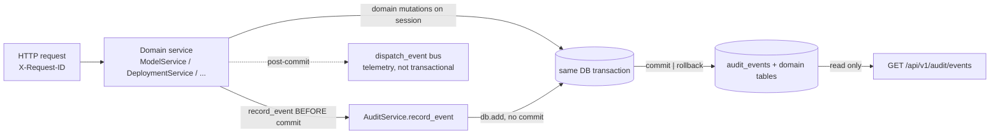

# Auditra - AI Model Inventory / Audit Specification

## 1. Purpose

Audit is the append-only evidence trail for the AI Model Inventory: every
material change to a governed model, deployment, or endpoint writes exactly
one structured event into PostgreSQL within the same transaction as the
mutation itself. Auditors answer "what changed, when, by whom, from which
source, and what did the record look like before and after" through a
read-only query API — without trusting application logs and without any way
to rewrite history.

## 2. Scope (V1)

**In scope:** `audit_events` table (migration `0007`), centralized payload
sanitizer, `AuditService` (record/read), read-only HTTP query API, and
transactional hooks in `ModelService`, `DiscoveryService`, `DeploymentService`,
and `DeploymentEndpointService`.

**Out of scope:** write/mutation endpoints for audit data, retention/pruning
jobs, async or outbox-based writers, OpenTelemetry trace correlation,
authorization enforcement (extension point only), and auditing of model
versions, applications, agents, usage events, and discovery ingest/match/ignore
actions.

## 3. Architecture



Core rule: `record_event` stages the event on the caller's session **before**
the caller's existing `commit(db)`. Commit persists mutation and audit row
together; any failure — including an audit write failure — rolls both back
(§22/§23). The pre-existing `dispatch_event` in-process bus runs post-commit
with no session and is deliberately not used for audit (ADR-03).

## 4. Event Taxonomy

Event names are lowercase, dot-delimited `<resource>.<action>`, stored as
strings and validated against `^[a-z][a-z0-9_]*\.[a-z][a-z0-9_]*$`
(`EVENT_TYPE_PATTERN`). Ten members (`AuditEventType`):

| Event | Emitted by | Trigger |
|---|---|---|
| `model.created` | `ModelService.register_model` | `POST /models` and discovery registration (via ModelService) |
| `model.registered` | `DiscoveryService.register` only | discovery status → REGISTERED |
| `model.updated` | `ModelService.update_model` / `archive_model` | non-no-op field changes; archive → `changed_fields=["lifecycle_state"]` |
| `deployment.created` | `DeploymentService.create_deployment` | deployment row created |
| `deployment.updated` | `DeploymentService.update_deployment` | non-no-op field changes |
| `deployment.status_changed` | `DeploymentService.transition_deployment` | lifecycle transition |
| `deployment.archived` | `DeploymentService.archive_deployment` | soft archive (never physical delete) |
| `deployment_endpoint.created` | `DeploymentEndpointService.create_endpoint` | endpoint row created |
| `deployment_endpoint.updated` | `DeploymentEndpointService.update_endpoint` | non-no-op field changes |
| `deployment_endpoint.archived` | `DeploymentEndpointService.archive_endpoint` | soft archive |

Deliberately omitted: `deployment.environment_changed` (environment is
immutable after create — the event could never fire), `deployment.deleted`
(archives only, ADR-02), and a generic `deployment.changed` (the domain's
operations classify cleanly). No-op updates emit nothing.

## 5. Domain Model

One `AuditEvent` row per material change:

- **Identity/order:** `id` (UUID), `sequence_no` (global `BIGINT` identity,
  unique — the canonical ordering key)
- **Classification:** `event_type`, `resource_type`, `resource_id` (string,
  no FK)
- **Attribution:** `actor_type` (`user`/`system`), `actor_id`, `source`
  (string, default `api`), `request_id`, `correlation_id` (reserved, NULL)
- **Time:** `occurred_at` (domain time, tz-aware UTC), `recorded_at`
  (persistence time, server `now()`)
- **Payload:** `schema_version` (currently 1), `changed_fields` (sorted
  list), `before_state`, `after_state`, `metadata` — all sanitized JSON
- **Tenancy:** `tenant_id` scoping on every row and query

States are governance-relevant projections (`model_audit_state`,
`deployment_audit_state`, `endpoint_audit_state`), not full row dumps.

## 6. Database Schema

Table `audit_events` (migration `0007_audit_events.py`, downgrade → `0006`):

| Column | Type | Notes |
|---|---|---|
| `id` | UUID | PK |
| `tenant_id` | UUID | indexed via composite indexes below |
| `sequence_no` | BIGINT IDENTITY | `uq_audit_events_sequence_no`, unique |
| `event_type` | VARCHAR(120) | validated in service layer |
| `resource_type` | VARCHAR(80) | |
| `resource_id` | VARCHAR(255) | no FK by design (ADR-10) |
| `actor_type` | VARCHAR(40) | |
| `actor_id` | VARCHAR(255) NULL | |
| `source` | VARCHAR(80) | |
| `occurred_at` | TIMESTAMPTZ | |
| `recorded_at` | TIMESTAMPTZ | `server_default now()` |
| `request_id` | VARCHAR(255) NULL | |
| `correlation_id` | VARCHAR(255) NULL | no V1 producer |
| `schema_version` | INT | `ck_audit_events_schema_version_positive` (`> 0`), default 1 |
| `changed_fields` | JSON/JSONB | |
| `before_state` | JSON/JSONB | |
| `after_state` | JSON/JSONB | |
| `metadata` | JSON/JSONB | Python attr `metadata_` |

Indexes (all tenant-scoped, ordered `sequence_no DESC` unless noted):

1. `ix_audit_events_tenant_resource_type_resource_id_sequence` — per-resource history
2. `ix_audit_events_tenant_event_type_sequence` — filter by event type
3. `ix_audit_events_tenant_occurred_at_sequence` — `(occurred_at DESC, sequence_no DESC)` time windows
4. `ix_audit_events_tenant_actor_sequence` — `(actor_type, actor_id)` attribution
5. `ix_audit_events_tenant_source_sequence` — filter by source

## 7. Transaction Behavior

- `AuditService.record_event(...)` validates, sanitizes, and `db.add`s the
  event — **no commit, no flush** (§22).
- Every hook runs *before* the domain service's existing `commit(db)`:
  mutation and audit row commit atomically; an audit failure (or any later
  error) rolls the mutation back too.
- Snapshots (`before_state`) are captured *before* mutation; `after_state`
  after mutation, still pre-commit.
- `model.created` during discovery registration commits inside
  `ModelService.register_model`; `model.registered` joins the subsequent
  discovery-status commit — a failure between them leaves the model created
  but the discovery unregistered (pre-existing two-commit shape of
  `DiscoveryService.register`).
- The append-only guarantee is structural: the repository module exposes only
  `append`/`get_event`/`list_events`, and there are no HTTP mutation routes
  (`POST/PUT/PATCH/DELETE` on audit paths → 405).

## 8. Integration Points

| Service | Constructor | Hooks |
|---|---|---|
| `ModelService` | `source`, `self.audit` | create / update / archive |
| `DiscoveryService` | `source`, `self.audit` | `model.registered` in `register()` |
| `DeploymentService` | `source`, `self.audit` | create / update / transition / archive |
| `DeploymentEndpointService` | `source`, `self.audit` | create / update / archive |

All four receive `request_id` and `actor: str | None` from their existing
route wiring; `source` defaults to `"api"`. State snapshots are module-level
functions (`model_audit_state`, `deployment_audit_state`,
`endpoint_audit_state`) so tests and future writers share one projection.
The post-commit `dispatch_event` bus is untouched.

## 9. API Endpoints

Read-only (OpenAPI at `/docs`):

| Method | Path | Description |
|---|---|---|
| GET | `/api/v1/audit/events` | Filtered, paginated list (`sequence_no DESC`) |
| GET | `/api/v1/audit/events/{event_id}` | Single event (404 `AUDIT_EVENT_NOT_FOUND`) |

List response envelope: `{items, page, page_size, total, total_pages}`.
No POST/PUT/PATCH/DELETE routes exist for audit resources.

## 10. Query and Filter Behavior

`GET /api/v1/audit/events` query parameters (all optional, AND-combined):

`resource_type`, `resource_id`, `event_type`, `actor_type`, `actor_id`,
`source`, `request_id`, `correlation_id`, `occurred_from`, `occurred_to`,
`page` (≥1, default 1), `page_size` (1–200, default 50).

- Ordering is always `sequence_no DESC` — stable and total within the tenant.
- `event_type` is validated against `EVENT_TYPE_PATTERN`; a malformed value
  → 400 `INVALID_AUDIT_FILTER`.
- `occurred_from > occurred_to` → 400 `INVALID_AUDIT_FILTER`.
- Naive datetimes are interpreted as UTC; aware datetimes pass through.
- Pagination is offset-based (ADR-07), enforced by the same indexes as §6.

## 11. Security

- Every query is scoped to `tenant_id` (`settings.default_tenant_id` in V1).
- Both routes carry `Depends(get_audit_reader)` — the single authorization
  extension point. It is a pass-through today because no IAM exists anywhere
  in the repository; a future RBAC layer enforces `ai_inventory.audit.read`
  there with 401/403 without touching storage or query logic (ADR-08).
- Errors use the standard domain envelope:
  `{"error": {code, message, details, request_id, http_status}}`.
- No secrets are accepted or emitted by the API; payloads are sanitized
  on write (§12), so readers cannot exfiltrate credentials even by querying.

## 12. Sensitive-Data Handling

All `before_state`/`after_state`/`metadata` pass through the single central
sanitizer (`app/modules/audit/sanitization.py`) — no ad-hoc redaction exists
in endpoints or services (§17.1):

- Keys matching `(?i)(password|passwd|secret|token|api[_-]?key|credential|
  private[_-]?key|authorization|auth[_-]?reference|bearer)` keep the key but
  replace the value with `REDACTED` (e.g. endpoint `auth_reference`).
- String values are scrubbed for `Bearer …`, `sk-…`, and `key=value` /
  `key: value` secret shapes.
- Non-JSON types are converted (`datetime` → ISO-8601, `UUID` → `str`).
- The domain already rejects secret-like *metadata keys* at the schema
  boundary (`validate_metadata`), so the sanitizer is defense in depth.

## 13. Architectural Decisions

- **ADR-01 — Registration semantics.** `POST /models` is a single
  create-and-register operation → only `model.created` (no duplicate
  `model.registered`). `model.registered` is emitted *only* by
  `DiscoveryService.register`, with
  `metadata.registration_mode = "discovered_then_registered"`.
- **ADR-02 — Event taxonomy.** The ten events of §4 only. No
  `deployment.environment_changed` (environment immutable → dead event), no
  generic `deployment.changed`; `deployment.archived` instead of
  `deployment.deleted` (soft archive); `deployment_endpoint.*` granular
  events instead of a combined `deployment.endpoint_changed`.
- **ADR-03 — Integration point.** Direct `AuditService` calls before `commit`
  in domain services — never `dispatch_event` handlers (they run post-commit
  with no session, which would violate §22).
- **ADR-04 — Actor attribution.** `ActorContext(type, id)` derived from the
  existing `actor: str | None` service param: non-None → `user`, None →
  `system`. Explicit `actor_type` (e.g. `service`) is supported for future
  callers. No fabricated identities.
- **ADR-05 — Source.** Constructor param `source: str = "api"`, free-form
  string (not a DB enum) so `sdk`/`langgraph`/connector sources arrive
  without migration.
- **ADR-06 — Request context.** `request_id` from existing middleware is
  threaded into events; `correlation_id` column and filter exist but stay
  NULL (no producer). No `trace_id`/`span_id` columns — no OpenTelemetry in
  this repository.
- **ADR-07 — Offset pagination.** `page`/`page_size` with the repository
  envelope instead of cursor pagination, reusing the repo's offset standard
  as §34/§60 permit. Documented deviation from a cursor-based ADR.
- **ADR-08 — Authorization extension point instead of 401/403.**
  `get_audit_reader()` on both routes; no IAM exists, so auth behavior is
  documented as an extension point rather than implemented or tested.
- **ADR-09 — Audited scope.** Only model create/update/archive,
  discovery registration, deployment lifecycle, and endpoint lifecycle.
  Model versions, applications, agents, usage, and discovery
  ingest/ignore/match are out of scope; the schema accepts new
  `resource_type` values without migration.
- **ADR-10 — String identifiers, no foreign keys.** `resource_id` and
  `actor_id` are `VARCHAR` strings with no FK to domain tables — the audit
  trail must outlive (and never block) domain changes; `id`/`tenant_id`
  remain UUIDs per repo convention.

## 14. Testing

46 audit-focused tests (all green) plus migration and OpenAPI contract
coverage:

| File | Count | Covers |
|---|---|---|
| `tests/unit/test_audit_sanitization.py` | 5 | key/value redaction, nesting, JSON-safety |
| `tests/unit/test_audit_service_validation.py` | 6 | event-type/resource validation, actor mapping, append-only module, non-empty source |
| `tests/integration/test_audit_service.py` | 7 | persistence round-trip, filters/ordering, inverted range, missing event |
| `tests/api/test_audit_api.py` | 7 | list/detail endpoints, pagination, filters, 404/400, 405 on mutations |
| `tests/integration/test_model_audit.py` | 11 | model + discovery hooks, no-op silence, rollback on audit failure, secret values, request-id flow |
| `tests/integration/test_deployment_audit.py` | 10 | deployment/endpoint hooks, no-op silence, status/archived states, `auth_reference` redaction |
| `tests/integration/test_migration.py` | +1 | `0007` downgrade/upgrade, indexes, constraints |

Review-pinned invariants: no-op update emits no event; audit failure rolls
back the domain mutation; secrets never persisted; `sequence_no DESC`
ordering with tenant isolation; no audit mutation routes.

## 15. Examples

```http
GET /api/v1/audit/events?resource_type=model&resource_id=<model-uuid>&page_size=50
Accept: application/json
```

```json
{
  "items": [
    {
      "id": "0b91d1c7-6a5f-4d2e-9a01-5f1b63e8c442",
      "sequence_no": 42,
      "event_type": "model.updated",
      "resource_type": "model",
      "resource_id": "…",
      "actor": {"type": "user", "id": "alice@example.com"},
      "source": "api",
      "occurred_at": "2026-10-07T12:31:02.120481+00:00",
      "recorded_at": "2026-10-07T12:31:02.131592+00:00",
      "request_id": "8f14e45f-…",
      "correlation_id": null,
      "schema_version": 1,
      "changed_fields": ["owner_name"],
      "before_state": {"owner_name": "team-a"},
      "after_state": {"owner_name": "team-b"},
      "metadata": null
    }
  ],
  "page": 1,
  "page_size": 50,
  "total": 1,
  "total_pages": 1
}
```

Recording from a domain service:

```python
self.audit.record_event(
    event_type=AuditEventType.MODEL_CREATED,
    resource_type="model",
    resource_id=str(model_id),
    after_state=model_audit_state(model),
)
commit(self.db)  # mutation + audit row commit atomically
```

## 16. Future Extension Points

- Authorization: enforce `ai_inventory.audit.read` in `get_audit_reader()`.
- Sources: pass `source="sdk"` / `"langgraph"` from future entry points.
- New audited resources: add hooks + `resource_type` strings; no migration.
- `correlation_id`: thread a producer when distributed tracing arrives
  (columns and filter already exist).
- Retention: a pruning job partitioned by `occurred_at` when volume demands.

## 17. Operational Notes

- Migration: `uv run alembic upgrade head` applies `0007_audit_events`;
  downgrade to `0006` drops the table and its five indexes.
- Writes are synchronous and inline in the request path — audit latency adds
  to mutation latency; a failed audit write surfaces as the domain
  operation's 500 with full rollback.
- Ordering/gaps: `sequence_no` is an identity column, so gaps are normal and
  must not be interpreted as data loss.
- `recorded_at` is server time; `occurred_at` is application time — both
  tz-aware UTC.
- Test runs truncate `audit_events` like every other table (`conftest.py`).

## 18. Known Limitations

1. No 401/403 enforcement — reads are open until an IAM/RBAC layer lands
   (extension point documented, ADR-08).
2. Offset pagination degrades at deep pages; no cursor support (ADR-07).
3. No `trace_id`/`span_id`; `correlation_id` is always NULL (ADR-06).
4. No retention/pruning — the table grows unbounded.
5. Synchronous inline writes: audit failure fails the whole mutation (by
   design) and adds write latency to every hooked operation.
6. Pattern-based sanitization is best-effort; secret shapes outside the
   known patterns can pass through.
7. `resource_id` has no FK — after a hypothetical hard domain delete, the
   event remains but the resource no longer resolves (models/deployments are
   archived, not deleted, in V1).
8. Scope gaps by design (ADR-09): model versions, applications, agents,
   usage, and discovery ingest/ignore/match are not audited.
9. `model.registered` follows a two-commit flow during discovery
   registration — a crash between commits leaves the model created but the
   discovery unregistered.
