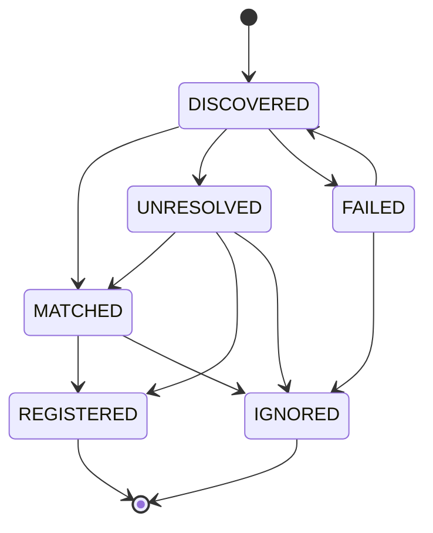

# Auditra - AI Model Inventory / Model Discovery Specification

## 1. Purpose

Model Discovery is the passive observation counterpart to Model Registration: it
captures models that applications and frameworks use at runtime (LangChain,
LangGraph, manual observation) and turns those observations into governed
inventory rows. Existing models are matched automatically; unknown models become
`UNRESOLVED` work items that an operator can match, ignore, or register.

## 2. Scope (V1)

**In scope:** ingestion API, `model_discovery` table, reconciliation against the
canonical model inventory, lifecycle state machine, list/filter API,
match/ignore/register actions, LangChain callback, LangGraph config helper,
structured-log audit hook.

**Out of scope:** background discovery jobs, hosted-LLM API scrapers, event
dispatcher emission (`model.discovered` is reserved for Feature 7), a generic
status-update endpoint, FAILED-state writers (see §16).

## 3. Architecture

```mermaid
flowchart LR
    subgraph sources [Sources]
        M[Manual API]
        LC[LangChain callback]
        LG[LangGraph config]
    end
    A[DiscoverySink contract] --> S[DiscoveryService]
    M -- POST /model-discovery --> A
    LC -- AuditraDiscoveryCallback --> A
    LG -- langgraph_discovery_config --> A
    S --> R[(model_discovery)]
    S -->|reconcile by canonical identity| INV[(models inventory)]
    S -.->|match / ignore / register .-> S2[ModelService]
```

Core rule: all sources converge on the `DiscoveryCreate` contract and the single
`DiscoveryService`; reconciliation logic is framework-agnostic and lives outside
`integrations/`.

## 4. Sources

| source_type | Producer | Notes |
|---|---|---|
| `manual` | `POST /api/v1/model-discovery` | Operator or upstream system registration |
| `langchain` | `AuditraDiscoveryCallback` | `on_chat_model_start` / `on_llm_start` |
| `langgraph` | `langgraph_discovery_config` | Same callback, `LANGGRAPH` source |

## 5. Domain Model

One row per `(tenant, source_type, source_identifier, canonical_identity)`:

- identity fields: `provider`, `model_identifier`, `canonical_identity`,
  optional `model_type`, `display_name`, `external_identifier`
- observation fields: `observation_count`, `first_seen_at` (never changes),
  `last_seen_at`, `metadata` (allowlisted, JSONB)
- lifecycle fields: `status`, `matched_model_id`, `error_code`, `error_message`

## 6. Identity Strategy

Canonical identity is built with the existing registration helper
`build_canonical_key(provider, native_model_id)` → **`"provider|native_model_id"`**
(e.g. `openai|gpt-5.x`). Deliberate decision: discovery rows use the same format
the inventory registers with, rather than a separate `provider:model` format, so
reconciliation is a single lookup.

Normalization: provider is trimmed, lowercased, and aliased
(`open_ai` → `openai`); model identifier is trimmed, blank rejected, case
preserved (`GPT-5.X` stays `GPT-5.X`).

## 7. Reconciliation

On ingest (and on `POST /match`), the service looks up
`find_by_canonical_key(tenant, canonical_identity)`:

- found → `MATCHED`, `matched_model_id` set
- not found → `UNRESOLVED`, `matched_model_id = null`

Replay/idempotency rules:

- repeated observation increments `observation_count`, updates `last_seen_at`,
  shallow-merges `metadata` (incoming keys win), keeps `first_seen_at`
- `IGNORED`, `REGISTERED`, `FAILED` are sticky: replay never heals them
- unique constraint fires on concurrent duplicate inserts; the service rolls
  back and treats the winner row as a repeat (race test covers this)

## 8. Lifecycle State Machine



- Transitions are validated in `can_transition`; every write path goes through it.
- `DISCOVERED` is internal only — rows are reconciled at creation, so the API
  always sees `UNRESOLVED`, `MATCHED`, `REGISTERED`, or `IGNORED`.
- Operator actions (`match`, `ignore`, `register`) reject same-state repeats with
  `409 DISCOVERY_TRANSITION_INVALID` (no self-loop edges in the diagram).
- No endpoint exposes a generic status setter; only these three actions exist.

## 9. Database Design

Table `model_discovery` (migration `0006_model_discovery`, reversible):

- `id` uuid PK, `tenant_id` uuid NOT NULL
- `source_type` varchar(32) CHECK in (`manual`, `langchain`, `langgraph`)
- `provider` varchar(100), `model_identifier` varchar(512),
  `canonical_identity` varchar(1024) NOT NULL
- `metadata` jsonb NOT NULL DEFAULT `{}`, `status` varchar(32) CHECK in the six
  lifecycle states, `matched_model_id` uuid FK → `models(id)` ON DELETE RESTRICT
- `observation_count` bigint CHECK `>= 1`, `first_seen_at`/`last_seen_at` NOT NULL
- unique `(tenant_id, source_type, source_identifier, canonical_identity)`
  **NULLS NOT DISTINCT** — manual observations with null `source_identifier`
  deduplicate
- indexes on `(tenant_id, status)`, `(tenant_id, provider)`,
  `(tenant_id, canonical_identity)`, `(tenant_id, source_type)`,
  `(tenant_id, last_seen_at DESC)`, `matched_model_id`

## 10. API Reference

Base: `/api/v1/model-discovery`

| Method | Path | Success | Notes |
|---|---|---|---|
| POST | `` | 201 / 200 | 200 on idempotent replay, `observation_count` incremented |
| GET | `` | 200 | filters: `source_type`, `source_identifier`, `provider`, `model_type`, `status`, `matched_model_id`, `canonical_identity`, `last_seen_from/to`, `search`; `page`/`page_size` (≤100); `sort_by`/`sort_order` |
| GET | `/{discovery_id}` | 200 | 404 `DISCOVERY_NOT_FOUND` |
| POST | `/{discovery_id}/match` | 200 | re-runs reconciliation against the inventory |
| POST | `/{discovery_id}/ignore` | 200 | operator exclusion, sticky |
| POST | `/{discovery_id}/register` | 201 | delegates to `ModelService.register_model` (`source_type=IMPORT`, `source_reference=model-discovery:{id}`), then marks `REGISTERED` |

Error codes: `VALIDATION_ERROR` (422), `DISCOVERY_NOT_FOUND` (404),
`DISCOVERY_TRANSITION_INVALID` (409), `DISCOVERY_QUERY_INVALID` (400),
`DISCOVERY_DUPLICATE` (409, repository-level).

## 11. LangChain Integration

```python
from app.modules.model_discovery.integrations import AuditraDiscoveryCallback
from app.modules.model_discovery.service import DiscoveryService, ServiceDiscoverySink

sink = ServiceDiscoverySink(DiscoveryService(db, tenant_id))
callback = AuditraDiscoveryCallback(sink, source_identifier="support-service")

model.invoke("hello", config={"callbacks": [callback], "metadata": {
    "auditra_provider": "openai",
    "auditra_model_identifier": "gpt-5.x",
    "auditra_environment": "production",
}})
```

- Identity resolution: `auditra_*` overrides win, else LangSmith tracing params
  (`ls_provider`, `ls_model_name`, `ls_model_type`; `chat` → `llm`).
- Missing identity → `InsufficientMetadataResult("INSUFFICIENT_METADATA")`
  logged, nothing persisted.
- Model class is read from `serialized["id"][-1]` only; `serialized["kwargs"]`
  is never read.
- Best-effort by default: sink failures are swallowed (`strict=True` re-raises)
  so instrumentation can never break a model invocation.

## 12. LangGraph Integration

```python
from app.modules.model_discovery.integrations.langgraph import langgraph_discovery_config

config = langgraph_discovery_config(
    sink, source_identifier="support-graph", environment="test"
)
config["metadata"].update({
    "auditra_provider": "openai",
    "auditra_model_identifier": "gpt-5.x",
})
graph.invoke({"messages": [...]}, config=config)
```

The helper returns a `RunnableConfig` (`tags`, `metadata`, `callbacks`) with the
callback fixed to source `langgraph`. Observations taken inside graph nodes carry
`metadata["langgraph_node"]` (e.g. `"call_model"`) for node-level context.

## 13. Security and Audit

- **No prompt/credential persistence:** adapters read only the `ls_*`/`auditra_*`
  allowlist plus `serialized["id"]`; `messages`, `prompts`, `kwargs`, and
  `invocation_params` are never read. Observation `metadata` is an explicit
  allowlist (`framework`, `framework_version`, `model_class`, `environment`,
  `langgraph_node`) — arbitrary keys (including `authorization`) are dropped.
- Metadata keys are checked by `validate_metadata` (secret-looking keys rejected
  at the API boundary, `422`).
- Logs (`auditra.discovery`) contain only ids, source type, canonical identity,
  status, counts, and error codes — never content.
- **Audit extension point:** `model.discovered`-style event names are reserved
  for Feature 7 (audit pipeline). In V1, the structured `auditra.discovery` log
  line is the audit hook.

## 14. Testing

- 104 tests across the discovery suites + migration round-trip
  (`tests/unit/test_discovery_*`, `tests/integration/test_discovery_service.py`,
  `tests/integration/test_langchain_discovery.py`,
  `tests/integration/test_langgraph_discovery.py`,
  `tests/api/test_discovery_api.py`); full backend suite: 516 tests.
- Includes: state-transition matrix, idempotent replay, duplicate-insert race,
  secret/prompt non-persistence (LangChain and LangGraph), OpenAPI contract.
- Framework runs use `GenericFakeChatModel` (no paid API).

## 15. Future Connectors

New connectors implement the `DiscoverySink` protocol (`observe`,
`insufficient_metadata`) and emit `DiscoveryCreate`; core reconciliation is
untouched. A speculative `discover(context)` pull interface was deliberately not
shipped in V1.

## 16. Limitations

- `FAILED` has no V1 writer (reserved for adapter-level validation failures);
  the state-machine edges exist but nothing produces the state.
- Replays do not heal `IGNORED`/`REGISTERED`/`FAILED` — deliberate, matches the
  spec's transition diagram.
- Identity matching is exact after normalization (no fuzzy matching).
- Single default-tenant wiring in routes (`settings.default_tenant_id`), same as
  other modules.
