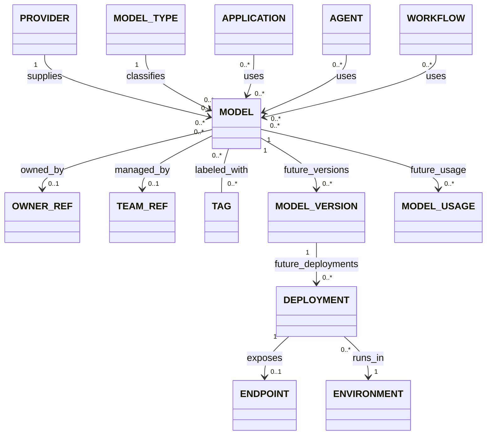
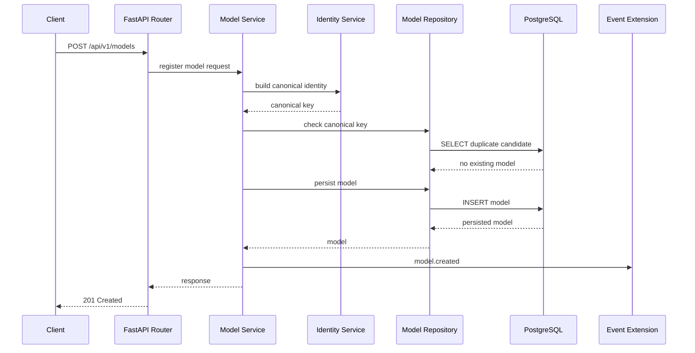
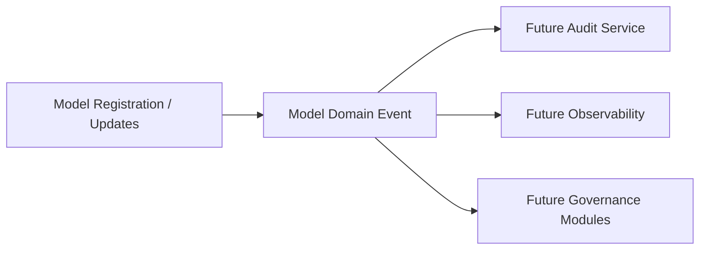
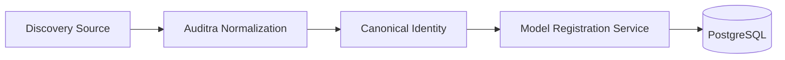
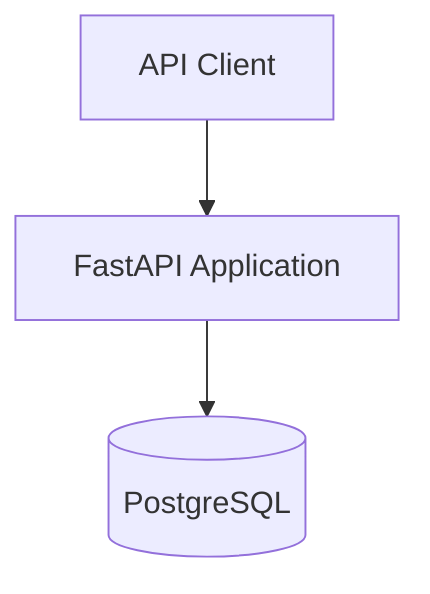
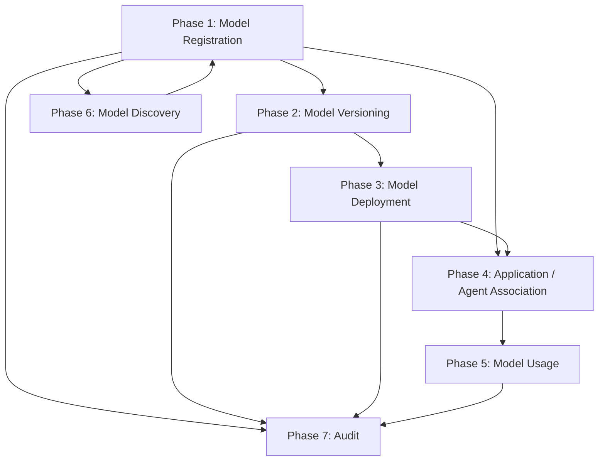

# Auditra — AI Model Inventory / Model Registration Specification

**Document type:** Authoritative feature specification for coding, testing, and review
**Feature:** AI Model Inventory
**Sub-feature:** 1. Model Registration
**Version:** V1
**Implementation style:** Modular monolith
**Primary backend:** Python 3.11+, FastAPI, Pydantic, SQLAlchemy, Alembic
**Primary persistence:** PostgreSQL
**Status:** Ready for implementation by a coding agent

---

## 1. Executive Summary

Auditra is an open-source enterprise AI Governance platform. The long-term platform is intended to cover AI/model inventory, asset discovery, risk and compliance, agent governance, evaluation, observability, audit/evidence, lifecycle management, data governance, security, cost governance, and related governance capabilities.

For the first implementation sequence, Auditra must begin with the foundational **AI Model Inventory** capability and, within that capability, implement **Model Registration** before versioning, deployment, discovery, usage tracking, or agent governance are added.

The first release is deliberately narrow:

> **Model Registration = a durable, validated, searchable, auditable registry of AI models and their core governance metadata.**

The implementation must not become a generic CRUD exercise. The model record is the stable identity/reference object that future Auditra modules will attach to.

The long-term conceptual inventory is:

```text
Model Registry
    +
AI Asset Inventory
    +
Governance Metadata
    +
Dependency Graph
    +
Lifecycle Registry
    +
Ownership
    +
Usage Context
    +
Audit Trail
```

For V1, only the portion required for **Model Registration** is implemented. Future concepts remain explicit extension points.

The provided Auditra architecture defines PostgreSQL as the relational source of truth, Redis as a non-authoritative cache/coordination layer, and RustFS as object storage for larger unstructured artifacts. V1 should keep PostgreSQL central and avoid introducing infrastructure that does not provide immediate value. fileciteturn0file0L68-L117

---

## 2. Feature Purpose

The purpose of Model Registration is to create a canonical Auditra identity for an AI model used, owned, supplied, or otherwise known by an organization.

The registry must let Auditra answer, at minimum:

- What model is this?
- Which provider supplies it?
- What kind of model is it?
- What is its canonical identity?
- What aliases/external identifiers are known?
- Who owns or is responsible for it?
- What lifecycle state is it currently in?
- What tags and metadata describe it?
- When was it registered?
- When was it last changed?
- How was it registered/discovered?

The resulting model identity must be stable enough for future Model Version, Deployment, Application, Agent, Usage, Discovery, and Audit features to reference without redesigning the foundational entity.

---

## 3. Goals

### 3.1 V1 goals

1. Provide create, retrieve, list, update, and archive operations for models.
2. Persist core model metadata in PostgreSQL.
3. Represent providers as data rather than hard-coded application logic.
4. Represent model type using an extensible taxonomy.
5. Support ownership metadata without implementing full enterprise IAM.
6. Support lifecycle state with controlled transitions.
7. Support tags and provider-specific metadata where appropriate.
8. Generate a stable internal model identifier.
9. Define and enforce a canonical identity strategy.
10. Detect likely duplicate registrations deterministically.
11. Provide pagination, filtering, sorting, and practical text search.
12. Make the model entity tenant-ready without requiring full multi-tenancy in V1.
13. Provide a small audit extension point for create/update/archive events.
14. Provide unit, API, and PostgreSQL integration tests.
15. Keep the architecture ready for future model versions, deployments, discovery, usage, and agent/application associations.

### 3.2 Architectural goals

- Modular monolith.
- Separation between API, domain/service, repository, and persistence concerns.
- PostgreSQL as source of truth.
- No unnecessary microservices.
- Cloud-neutral and self-hostable.
- Open-source friendly.
- Observable and testable.
- Provider-agnostic.
- Runtime-agnostic.
- Extensible without turning the core schema into one giant JSON document.

---

## 4. Non-Goals

The following must **not** be implemented as part of Model Registration V1:

- Model version management.
- Model deployment management.
- Environment/deployment management as a first-class subsystem.
- Endpoint management.
- Automated model discovery.
- LangChain integration logic.
- LangGraph integration logic.
- Agent registration/governance.
- Application registration/association.
- Workflow registration.
- Usage/event collection.
- Evaluation.
- Risk assessment.
- Compliance management.
- Security governance.
- Cost governance.
- Full observability platform.
- Full enterprise IAM/RBAC.
- Full audit platform.
- Vector search.
- Kafka/event streaming.
- Kubernetes deployment for V1.
- Frontend implementation.
- Provider credential/secret storage.

The future architecture may refer to these capabilities, but the implementation boundary must remain clear.

---

## 5. AI Model Inventory Sub-Feature Map

The complete conceptual inventory is:

```text
AI Model Inventory
│
├── 1. Model Registration              <-- CURRENT V1
│   ├── Model CRUD
│   ├── Provider
│   ├── Model Type
│   ├── Metadata
│   └── Ownership
│
├── 2. Model Versioning                <-- FUTURE
│   ├── Versions
│   ├── Version metadata
│   └── Lifecycle
│
├── 3. Model Deployment                <-- FUTURE
│   ├── Deployment
│   ├── Environment
│   └── Endpoint
│
├── 4. Application / Agent Association  <-- FUTURE
│   ├── Application
│   ├── Agent
│   └── Model ↔ Agent relationship
│
├── 5. Model Usage                     <-- FUTURE
│   ├── Usage events
│   ├── Request metadata
│   └── Basic statistics
│
├── 6. Model Discovery                 <-- FUTURE
│   ├── Manual
│   ├── LangChain
│   ├── LangGraph
│   └── Future connectors
│
└── 7. Audit                            <-- FUTURE
    ├── Created
    ├── Updated
    ├── Registered
    └── Deployment changes
```

V1 establishes the `Model` identity and the registration contract that future sub-features consume.

---

## 6. Research Summary

### 6.1 Established/common patterns identified

#### MLflow Model Registry

MLflow separates a registered model from model versions and provides metadata such as aliases and tags. This is useful evidence for keeping **Model** distinct from **ModelVersion** and for using explicit metadata/tag concepts rather than putting everything into one unstructured field. citeturn531718search7

**Auditra adoption:**

- Adopt distinct model identity now.
- Keep versioning as a separate future entity.
- Support tags now.
- Do not copy MLflow's entire registry lifecycle or deployment semantics into V1.

#### Kubeflow Model Registry

Kubeflow's registry exposes a logical model, model version, and artifact model, with metadata retrievable through an API and usable by later serving/deployment systems. This reinforces the architectural boundary between registry metadata and deployment/serving concerns. citeturn959545search1

**Auditra adoption:**

- Keep registry metadata independent from serving/deployment.
- Design future deployment references to stable registry identifiers.
- Do not introduce artifact tables into V1 unless an actual artifact requirement appears.

#### Hugging Face

Hugging Face model repositories combine human-readable model-card content with structured metadata. Model-card metadata can include task/pipeline information, license information, datasets, tags, base models, and other attributes. Custom tags are also supported. citeturn531718search0turn531718search8

**Auditra adoption:**

- Preserve a structured core model schema.
- Allow extensible metadata through JSONB.
- Support tags.
- Treat rich documentation/model cards as future RustFS-backed artifacts, not mandatory V1 data.

#### LangChain

LangChain presents a common model interface across providers and uses provider/model identifiers, such as a provider-qualified model string. This supports Auditra's decision to maintain separate provider identity and provider-specific model identifiers rather than hard-coding a fixed provider enum into core business logic. citeturn959545search2

**Auditra adoption:**

- Store provider as data.
- Store the provider's native model identifier separately from Auditra's internal ID.
- Treat LangChain as a future adapter/discovery source, not as Auditra's canonical domain model.

#### LangGraph

LangGraph models agent workflows as graphs composed of state, nodes, and edges. A node may contain an LLM call or ordinary application logic. This makes it important not to treat a model as synonymous with an agent or workflow. citeturn959545search4

**Auditra adoption:**

- `Model`, `Agent`, and `Workflow` remain distinct future concepts.
- Future adapters may associate an agent/workflow with one or more models.

#### OpenTelemetry / OpenInference

OpenTelemetry provides general semantic conventions for traces, metrics, logs, and resources. OpenInference builds AI-specific semantic conventions on top of OpenTelemetry and explicitly distinguishes LLM, embedding, reranker, agent, tool, retriever, and related operation types. It also distinguishes system/provider/model-name fields. citeturn531718search6turn426710search0turn426710search1

**Auditra adoption:**

- Keep AI model identity fields compatible with future telemetry mapping.
- Do not implement tracing in V1.
- Avoid defining a model schema that conflicts with future telemetry attributes.

#### AI/ML Bill of Materials

CycloneDX describes ML-BOM as a way to represent models, datasets, configuration, provenance, and AI/ML dependencies for supply-chain transparency. This is relevant to future Auditra supply-chain governance, but it is outside Model Registration V1. citeturn959545search3

### 6.2 Governance/inventory pattern

NIST AI RMF guidance describes an AI system inventory as an organized database of artifacts about AI systems/models and highlights the value of maintaining responsible contacts and broad organizational visibility into AI assets. citeturn959545search5

**Auditra adoption:** ownership, responsibility, documentation references, and inventory completeness are first-class governance concerns, even though full risk governance is outside V1.

### 6.3 Emerging vs. established

| Topic | Classification | Auditra treatment |
|---|---|---|
| Model registry | Established | Implement in V1 |
| Model metadata | Established | Implement in V1 |
| Tags/labels | Established | Implement in V1 |
| Model/version distinction | Established | Design now; implement versioning later |
| Deployment as separate concept | Established/common pattern | Future |
| AI system inventory | Established governance practice | Foundational purpose |
| OpenTelemetry semantic conventions | Established ecosystem standard | Compatibility only in V1 |
| OpenInference AI telemetry semantics | Emerging/common ecosystem convention | Future compatibility |
| AI/ML-BOM | Emerging governance/supply-chain practice | Future |
| Automated shadow-AI discovery | Emerging capability | Future discovery module |
| Cryptographically verifiable AI provenance | Emerging/advanced | Future supply-chain capability |

---

## 7. Auditra Architecture Decisions

### 7.1 Core decision

Model Registration is implemented as a **bounded module inside a modular monolith**, not as its own microservice.

### 7.2 Module boundary

The Model Inventory module owns:

- model registration lifecycle;
- provider reference data needed for registration;
- model taxonomy used by registration;
- ownership metadata needed by registration;
- tags;
- canonical identity;
- model metadata;
- model archive state;
- registration-origin metadata;
- extension-point events.

It does not own future deployment, application, agent, usage, or evaluation domains.

### 7.3 Source of truth

PostgreSQL is the authoritative source for model registration records.

Redis must not be required for correctness.

RustFS must not be required for core registration correctness.

### 7.4 Stable internal identity

Every model must receive a stable UUID generated by Auditra. Internal references in future modules must use this identifier, not the provider's model name.

### 7.5 Provider-agnostic architecture

Providers are represented as data records with stable IDs. New providers must be addable without modifying the core `Model` schema.

### 7.6 Taxonomy extensibility

Model type should be a configurable reference rather than a rigid database enum in V1. A small curated seed taxonomy can be provided, while the schema remains extensible.

### 7.7 Soft deletion/archive

Models should be archived rather than physically deleted by default. This protects references, history, and future governance integrity.

Hard deletion should not be exposed as a normal public API operation in V1 unless a documented operational purge mechanism is separately introduced.

---

## 8. Domain Model

### 8.1 Conceptual entities

| Concept | V1 status | Domain role |
|---|---|---|
| Model | **CURRENT** | Canonical model identity |
| Provider | **CURRENT** | Supplier/host/provider identity |
| Model Type | **CURRENT** | Configurable taxonomy reference |
| Owner reference | **CURRENT** | Responsibility metadata |
| Team reference | **CURRENT/limited** | Optional organizational ownership reference |
| Tag | **CURRENT** | Searchable classification metadata |
| Model Version | FUTURE | Concrete immutable model revision |
| Deployment | FUTURE | Running/deployed instance |
| Environment | FUTURE | Dev/stage/prod/etc. |
| Endpoint | FUTURE | Accessible inference/service endpoint |
| Application | FUTURE | Business/application consumer |
| Agent | FUTURE | AI agent consumer |
| Workflow | FUTURE | Workflow/orchestration consumer |
| Model Usage | FUTURE | Runtime use event/statistics |
| Audit Event | FUTURE/extension | Historical change/event record |
| Artifact | FUTURE | Large model/document artifact |
| Evaluation | FUTURE | Evaluation record |
| Risk Assessment | FUTURE | Governance risk record |

### 8.2 Relationship model



### 8.3 Important semantic distinction

```text
Provider
    = who supplies/hosts the model identity

Model
    = logical AI model identity tracked by Auditra

Model Version
    = concrete revision/version of a model

Deployment
    = a running/operational instance of a specific version

Endpoint
    = network/API access point for a deployment

Runtime
    = software/infrastructure mechanism serving the model

Application / Agent / Workflow
    = consumers/orchestrators that use a model

Model Usage
    = runtime evidence that a model was actually invoked
```

The V1 database must not collapse these concepts.

---

## 9. Model Identity Strategy

### 9.1 Identity layers

Auditra should maintain three identity layers:

1. **Internal Auditra ID** — UUID, immutable, generated by Auditra.
2. **Canonical external identity** — normalized identity derived from provider + model namespace/identifier and other identity attributes required for uniqueness.
3. **External IDs / aliases** — provider IDs, repository IDs, deployment identifiers, human aliases, or discovery-source identifiers.

### 9.2 Recommended canonical identity

For V1, use a deterministic canonical identity string based on:

```text
provider_identity
+
normalized_model_identifier
```

Optionally include a provider account/namespace only when the provider genuinely distinguishes models by namespace.

Example conceptual identities:

```text
openai|gpt-family-model-id
meta|llama-model-id
huggingface|org/repository
internal|uav-yolo-detector
```

Do not include environment or deployment in the core model identity. Those belong to future deployment records.

### 9.3 Normalization rules

Canonical identity generation must:

- trim surrounding whitespace;
- normalize case only where provider identity semantics permit it;
- preserve case-sensitive native identifiers when required;
- normalize provider identifier representation;
- reject empty provider/model identifiers;
- avoid changing semantically distinct identifiers;
- be deterministic across repeated calls.

Provider-specific normalization behavior must live behind the identity service, not scattered across API routers.

### 9.4 Duplicate detection

V1 duplicate detection must be deterministic for exact canonical identities.

Recommended behavior:

- exact canonical identity match → registration conflict;
- same provider + same native model identifier → conflict even if display name differs;
- same display name but different provider/native identifier → allowed;
- same model discovered from different sources → future source reconciliation, not a separate model merely because source differs.

### 9.5 Fingerprints

A cryptographic artifact/model fingerprint is **not required in V1** because model artifacts and immutable versions are outside scope.

The schema should leave a future extension point for artifact/version fingerprints.

### 9.6 Aliases

V1 may retain a limited alias field or metadata representation, but alias resolution must not replace the canonical identity. A normalized canonical key remains the uniqueness basis.

---

## 10. Provider Model

### 10.1 Provider requirements

Providers must be data-driven.

The database must not contain a fixed application-level provider enum such as `OPENAI`, `ANTHROPIC`, `OLLAMA`, etc. as the authoritative provider representation.

Examples that can be seeded:

- OpenAI
- Anthropic
- Google
- Meta
- Mistral
- Cohere
- Hugging Face
- AWS
- Azure
- GCP
- Ollama
- vLLM
- Internal/Custom

These are examples, not a closed list.

### 10.2 Provider fields

Recommended current provider fields:

| Field | Purpose |
|---|---|
| `id` | Stable UUID |
| `slug` | Stable machine identifier |
| `name` | Human-readable provider name |
| `description` | Optional description |
| `website_url` | Optional public URL |
| `is_active` | Whether provider can be selected for new registration |
| `metadata` | Provider-specific non-secret metadata |
| `created_at` | Audit metadata |
| `updated_at` | Audit metadata |

### 10.3 Provider secrets

API keys, bearer tokens, cloud credentials, client secrets, private keys, and similar credentials must not be stored in the normal `Model` or `Provider.metadata` JSONB field.

Credential storage is a future integration/security concern.

---

## 11. Model Taxonomy

### 11.1 Recommended V1 approach

Use a **database-backed configurable taxonomy** for model types.

Do not use a closed PostgreSQL enum for the long-term taxonomy because Auditra is intended to support future AI modalities and enterprise-specific categories.

### 11.2 Seed taxonomy

The initial seed set should include at least:

- LLM
- Generative AI
- Embedding Model
- Reranker
- NLP Model
- Computer Vision Model
- Multimodal Model
- Classification Model
- Object Detection Model
- Recommendation Model
- Forecasting Model
- Speech Model
- Deep Learning Model
- Reinforcement Learning Model
- Custom ML Model

A model may need more than one classification in the future. The V1 schema should therefore not make `model_type_id` the only possible taxonomy mechanism forever.

### 11.3 V1 simplification

For V1, use one primary model type reference plus extensible metadata/tags. A future many-to-many capability can support multiple capabilities/types without breaking the model table.

---

## 12. Model Lifecycle

### 12.1 V1 states

Recommended states:

```text
REGISTERED
ACTIVE
DEPRECATED
RETIRED
ARCHIVED
```

`DISCOVERED` is conceptually useful for future automated discovery, but it should not be required for the manual registration flow. A discovered-but-not-reviewed state belongs more naturally to the future discovery workflow.

### 12.2 V1 transition rules

```text
REGISTERED -> ACTIVE
REGISTERED -> DEPRECATED
REGISTERED -> ARCHIVED

ACTIVE -> DEPRECATED
ACTIVE -> RETIRED
ACTIVE -> ARCHIVED

DEPRECATED -> ACTIVE
DEPRECATED -> RETIRED
DEPRECATED -> ARCHIVED

RETIRED -> ARCHIVED

ARCHIVED -> no normal state transitions
```

### 12.3 State semantics

- `REGISTERED`: identity exists and is recorded, but operational usage status has not been asserted.
- `ACTIVE`: model is considered currently usable/approved for organizational use.
- `DEPRECATED`: model remains registered but should not be adopted for new use.
- `RETIRED`: model should no longer be used operationally.
- `ARCHIVED`: record is retained for history and is not normally mutable.

### 12.4 Who may change state

V1 does not implement enterprise RBAC, so the service layer must enforce transition rules and leave the authorization decision to the existing/future authentication boundary.

### 12.5 Audit

Lifecycle changes must emit the same extension-point events as other model updates.

---

## 13. V1 — Model Registration

### 13.1 Registration must support

- Create model.
- Get model by ID.
- List/search models.
- Update editable metadata.
- Archive model.
- Provider association.
- Primary model type.
- Display name.
- Native/provider model identifier.
- Description.
- Ownership reference.
- Team reference where available.
- Tags.
- Lifecycle state.
- Hosting/runtime hints as metadata, without implementing deployment.
- Source/registration origin.
- External identifier(s) as appropriate.
- Created/updated timestamps.
- Canonical identity.

### 13.2 Recommended V1 model fields

| Field | Required | Notes |
|---|---:|---|
| `id` | Yes | UUID, immutable |
| `tenant_id` | Yes in schema; controlled value in V1 | Future tenant isolation anchor |
| `provider_id` | Yes | FK to provider |
| `model_type_id` | Yes | FK to model taxonomy |
| `name` | Yes | Human-readable display name |
| `native_model_id` | Yes | Provider-native identifier |
| `canonical_key` | Yes | Deterministic uniqueness key |
| `description` | No | Human-readable description |
| `owner_name` | No | V1 ownership reference |
| `owner_contact` | No | Contact address/handle, not a credential |
| `team_name` | No | V1 organizational hint |
| `lifecycle_state` | Yes | Controlled lifecycle |
| `source_type` | Yes | Registration origin |
| `source_reference` | No | External system/reference identifier |
| `tags` | Optional | Structured or normalized tag representation |
| `metadata` | No | JSONB, provider/domain-specific non-secret metadata |
| `created_at` | Yes | UTC timestamp |
| `updated_at` | Yes | UTC timestamp |
| `archived_at` | No | UTC timestamp |
| `created_by` | No | Future/user reference; string/UUID-compatible |
| `updated_by` | No | Future/user reference |
| `version` | Yes | Optimistic concurrency field or equivalent |

### 13.3 Runtime/hosting fields

V1 should not create deployment tables, but the model can contain a small set of descriptive fields such as `hosting_mode` or `runtime_hint` only if they describe the logical model's normal delivery mechanism and are explicitly documented as non-deployment metadata.

Examples:

```text
CLOUD_API
SAAS_API
SELF_HOSTED
LOCAL
ON_PREMISE
EDGE
EMBEDDED
CUSTOM
```

These must not encode a specific production deployment, endpoint, pod, Kubernetes service, or environment. Those belong to the future Deployment sub-feature.

---

## 14. PostgreSQL Design

### 14.1 V1 tables

The recommended minimum V1 schema is:

1. `model_providers`
2. `model_types`
3. `models`
4. `model_tags`
5. `model_tag_links` (or an equivalent normalized tag association)

A separate audit table is optional in V1 only if an existing platform-wide audit foundation already exists. Otherwise use an event/outbox extension point without making the full audit system a dependency.

### 14.2 Why these tables exist

#### `model_providers`

Stores provider identity independently from models. This prevents provider names from being duplicated across rows and supports new providers without schema changes.

#### `model_types`

Stores the extensible taxonomy.

#### `models`

Stores canonical model registration metadata and stable internal identity.

#### `model_tags`

Stores normalized reusable tags.

#### `model_tag_links`

Provides many-to-many model/tag association without packing search-critical tag data into JSONB.

### 14.3 Suggested `model_providers` columns

| Column | Type | Constraints |
|---|---|---|
| `id` | UUID | PK |
| `slug` | VARCHAR | UNIQUE, NOT NULL |
| `name` | VARCHAR | NOT NULL |
| `description` | TEXT | NULL |
| `website_url` | TEXT | NULL |
| `is_active` | BOOLEAN | NOT NULL, default true |
| `metadata` | JSONB | NOT NULL, default `{}` |
| `created_at` | TIMESTAMPTZ | NOT NULL |
| `updated_at` | TIMESTAMPTZ | NOT NULL |

### 14.4 Suggested `model_types` columns

| Column | Type | Constraints |
|---|---|---|
| `id` | UUID | PK |
| `slug` | VARCHAR | UNIQUE, NOT NULL |
| `name` | VARCHAR | NOT NULL |
| `description` | TEXT | NULL |
| `is_active` | BOOLEAN | NOT NULL |
| `is_system` | BOOLEAN | NOT NULL |
| `created_at` | TIMESTAMPTZ | NOT NULL |
| `updated_at` | TIMESTAMPTZ | NOT NULL |

### 14.5 Suggested `models` columns

| Column | Type | Constraints |
|---|---|---|
| `id` | UUID | PK |
| `tenant_id` | UUID | NOT NULL, indexed |
| `provider_id` | UUID | FK, NOT NULL |
| `model_type_id` | UUID | FK, NOT NULL |
| `name` | VARCHAR(255) | NOT NULL |
| `native_model_id` | VARCHAR(512) | NOT NULL |
| `canonical_key` | VARCHAR(1024) | NOT NULL, unique within tenant |
| `description` | TEXT | NULL |
| `owner_name` | VARCHAR(255) | NULL |
| `owner_contact` | VARCHAR(512) | NULL |
| `team_name` | VARCHAR(255) | NULL |
| `hosting_mode` | VARCHAR(64) | NULL |
| `lifecycle_state` | VARCHAR/enum-compatible | NOT NULL |
| `source_type` | VARCHAR(64) | NOT NULL |
| `source_reference` | VARCHAR(512) | NULL |
| `metadata` | JSONB | NOT NULL, default `{}` |
| `created_at` | TIMESTAMPTZ | NOT NULL |
| `updated_at` | TIMESTAMPTZ | NOT NULL |
| `archived_at` | TIMESTAMPTZ | NULL |
| `created_by` | UUID/string-compatible | NULL |
| `updated_by` | UUID/string-compatible | NULL |
| `record_version` | BIGINT | NOT NULL, default 1 |

### 14.6 Tag tables

`model_tags`:

| Column | Type | Constraints |
|---|---|---|
| `id` | UUID | PK |
| `tenant_id` | UUID | NOT NULL |
| `key` | VARCHAR(128) | NOT NULL |
| `value` | VARCHAR(512) | NOT NULL |
| `created_at` | TIMESTAMPTZ | NOT NULL |

Recommended unique constraint:

```text
(tenant_id, key, value)
```

`model_tag_links`:

| Column | Type | Constraints |
|---|---|---|
| `model_id` | UUID | FK, NOT NULL |
| `tag_id` | UUID | FK, NOT NULL |
| `created_at` | TIMESTAMPTZ | NOT NULL |

Primary key:

```text
(model_id, tag_id)
```

### 14.7 Unique constraints

At minimum:

```text
model_providers.slug unique
model_types.slug unique
models (tenant_id, canonical_key) unique
model_tags (tenant_id, key, value) unique
```

The exact tenant-scoping strategy may be relaxed to global providers/types if the project establishes those as platform-global lookup data. The important design principle is that model data is tenant-scoped while platform lookup data can remain global.

### 14.8 Indexes

Recommended indexes on `models`:

- `(tenant_id, lifecycle_state)`
- `(tenant_id, provider_id)`
- `(tenant_id, model_type_id)`
- `(tenant_id, created_at DESC)`
- `(tenant_id, updated_at DESC)`
- `(tenant_id, native_model_id)`
- `(tenant_id, canonical_key)` unique index

For practical text search, begin with PostgreSQL-native search rather than introducing Elasticsearch/OpenSearch.

A trigram index may be added later if profiling shows it is needed. Do not assume it is required before implementation evidence exists.

### 14.9 JSONB usage

`metadata` is appropriate for provider- or domain-specific values that:

- are not stable enough to deserve a first-class column yet;
- are not primary query keys;
- are not security secrets;
- should survive provider variation.

Examples:

```text
context_window
supported_modalities
parameter_count
license
base_model_reference
quantization
framework
custom_provider_attributes
```

Do not put these in JSONB when the field is operationally important, frequently queried, constrained, or part of a stable relationship.

### 14.10 Soft deletion

Preferred behavior:

- normal DELETE endpoint translates to archive operation;
- `archived_at` is populated;
- lifecycle changes to `ARCHIVED`;
- archived records remain queryable through an explicit include-archived option;
- default list excludes archived records;
- future references remain valid.

### 14.11 Timestamps

Use timezone-aware PostgreSQL `TIMESTAMPTZ` and store timestamps in UTC.

---

## 15. Multi-Tenancy Readiness

V1 does not need a full tenant administration system, but the schema should include a `tenant_id` boundary for model records.

Recommended approach:

- `tenant_id` is part of the `models` identity scope.
- All model repository queries require tenant context.
- Every unique business key involving models is tenant-scoped.
- Service methods must never silently query all tenants.
- Authentication/authorization integration can later supply the tenant context.

V1 may use a fixed development tenant or a configuration-provided tenant for local development, but this must be treated as an implementation convenience, not as removal of tenant-readiness from the schema.

Do not implement full tenant administration in this feature.

---

## 16. Ownership

### 16.1 V1 objective

Provide enough ownership information to answer:

> Who is responsible for this model?

without implementing the complete identity hierarchy.

### 16.2 V1 representation

Use lightweight ownership fields or a small ownership value object in the model domain, such as:

- owner name;
- owner contact;
- team name.

Do not create full `users`, `roles`, `teams`, `organizations`, and `permissions` tables solely for this feature if the existing platform does not already contain them.

### 16.3 Future evolution

Future identity integration can replace lightweight references with:

```text
Organization
    ↓
Tenant
    ↓
Team
    ↓
User / Service Identity
    ↓
Model Ownership
```

The initial model record must not make this future transition difficult.

---

## 17. FastAPI Architecture

### 17.1 Module boundary

Recommended backend organization:

```text
backend/
└── app/
    ├── core/
    │   ├── config/
    │   ├── db/
    │   ├── security/
    │   └── observability/
    │
    ├── modules/
    │   └── model_inventory/
    │       ├── api/
    │       ├── schemas/
    │       ├── domain/
    │       ├── services/
    │       ├── repositories/
    │       ├── models/
    │       ├── events/
    │       └── tests/
    │
    └── main.py
```

The exact repository naming can differ if the existing project already has a consistent convention. The architectural boundary is more important than the exact folder names.

### 17.2 Responsibilities

#### API/router layer

- Parse HTTP request.
- Validate request schema.
- Resolve authenticated/tenant context from the platform boundary.
- Call application/service layer.
- Translate domain/application errors into HTTP responses.
- Never contain database queries or duplicate identity rules.

#### Schema layer

- Request/response contracts.
- Input validation.
- Output serialization.
- No direct SQL logic.

#### Domain/service layer

- Canonical identity generation.
- Duplicate registration rules.
- Lifecycle transition validation.
- Ownership validation.
- Archive semantics.
- Business invariants.

#### Repository layer

- PostgreSQL access.
- Query composition.
- Pagination.
- Sorting/filtering primitives.
- Persistence mapping.

#### Database/model layer

- SQLAlchemy models.
- Relationship mappings.
- Database constraints.
- Alembic migrations.

#### Events layer

- Defines future-compatible model lifecycle events.
- V1 may dispatch in-process or to a small event abstraction.
- Must not require Kafka.

---

## 18. API Specification

Base path:

```text
/api/v1/models
```

### 18.1 Create Model

```text
POST /api/v1/models
```

**Purpose:** Register a new model.

**Request must support:**

- provider identifier or provider reference;
- model type;
- display name;
- native/provider model identifier;
- description;
- ownership fields;
- lifecycle state where permitted;
- tags;
- hosting/runtime hint if enabled;
- source type/reference;
- non-secret metadata.

**Validation:**

- required identifiers must be non-empty;
- provider must exist and be active;
- model type must exist and be active;
- canonical identity must be generated server-side;
- duplicate canonical identity must be rejected;
- metadata must be valid JSON-safe structured data;
- secrets must be rejected from explicitly secret-sensitive fields;
- lifecycle state must be one of the allowed values.

**Success:** `201 Created`

**Duplicate:** `409 Conflict`

**Validation failure:** `422 Unprocessable Entity`

### 18.2 Get Model

```text
GET /api/v1/models/{model_id}
```

**Success:** `200 OK`

**Not found:** `404 Not Found`

The response should include the canonical model representation and resolved provider/type summary.

### 18.3 List Models

```text
GET /api/v1/models
```

Supported query parameters:

```text
page
page_size
provider
model_type
lifecycle_state
owner
team
source_type
tag
search
created_after
created_before
updated_after
updated_before
include_archived
sort_by
sort_order
```

V1 should use offset pagination unless the existing project already standardizes on cursor pagination.

Recommended defaults:

```text
page=1
page_size=25
max_page_size=100
sort_by=updated_at
sort_order=desc
```

**Success:** `200 OK`

### 18.4 Update Model

```text
PATCH /api/v1/models/{model_id}
```

Only mutable fields may be changed.

Immutable fields:

- `id`;
- `canonical_key`;
- provider-native identity fields that define canonical identity, unless an explicit future identity-migration operation is introduced.

For V1, changing `provider_id` or `native_model_id` should be rejected rather than silently changing the identity of an existing model. Register a new model instead.

**Success:** `200 OK`

**Not found:** `404 Not Found`

**Conflict:** `409 Conflict`

### 18.5 Archive Model

```text
DELETE /api/v1/models/{model_id}
```

This endpoint performs a **logical archive**, not physical deletion.

Expected effects:

- lifecycle state becomes `ARCHIVED`;
- `archived_at` is populated;
- an archive event is emitted through the audit extension point;
- the model disappears from normal list results;
- the record remains in PostgreSQL.

**Success:** `204 No Content` is preferred for a delete-style API.

### 18.6 Optional provider lookup endpoints

Provider lookup endpoints may be exposed if needed by clients:

```text
GET /api/v1/model-providers
GET /api/v1/model-types
```

These are supporting lookup APIs, not separate features.

---

## 19. API Error Model

Use a consistent API error envelope.

Conceptually:

```text
error
  code
  message
  details
  request_id
```

Recommended domain error codes:

- `MODEL_NOT_FOUND`
- `MODEL_ALREADY_EXISTS`
- `MODEL_IDENTITY_CONFLICT`
- `PROVIDER_NOT_FOUND`
- `PROVIDER_INACTIVE`
- `MODEL_TYPE_NOT_FOUND`
- `INVALID_LIFECYCLE_TRANSITION`
- `MODEL_ARCHIVED`
- `INVALID_FILTER`
- `INVALID_SORT_FIELD`
- `INVALID_SORT_ORDER`
- `VALIDATION_ERROR`
- `INTERNAL_ERROR`

Error messages must be safe for external clients and must not leak database internals, connection details, secrets, or stack traces.

---

## 20. Pydantic Schemas

The API contract should define at least:

### `ModelCreate`

Input fields corresponding to the creation contract.

### `ModelUpdate`

Only mutable fields.

### `ModelResponse`

Canonical serialized model, including:

- ID;
- provider summary;
- model type summary;
- canonical identity;
- model metadata;
- ownership;
- lifecycle;
- tags;
- source;
- timestamps;
- version/concurrency information where exposed.

### `ModelListResponse`

Must include:

- items;
- page;
- page size;
- total count;
- optional total pages;
- applied filter/sort metadata if the project convention requires it.

### Supporting schemas

Potential supporting schemas:

- `ProviderSummary`
- `ModelTypeSummary`
- `TagResponse`
- `PaginationMeta`
- `ModelMetadata`
- `ModelOwnership`
- `ModelLifecycleTransition`

### Schema separation rule

Do not reuse SQLAlchemy ORM models directly as external API request models.

Use separate:

```text
API Schema
    ↓
Service/domain input
    ↓
Repository/persistence model
```

This prevents database details from becoming public API contracts.

---

## 21. Service / Repository Architecture

### 21.1 Suggested service operations

The application/service layer should provide operations equivalent to:

- `register_model`
- `get_model`
- `list_models`
- `update_model`
- `archive_model`
- `validate_lifecycle_transition`
- `build_canonical_identity`
- `check_duplicate_identity`

The exact method names may follow existing repository conventions.

### 21.2 Registration flow



### 21.3 Transaction boundary

Model registration must execute as a database transaction.

The duplicate check is useful for friendly error handling, but the database unique constraint is the final correctness boundary against concurrent duplicate requests.

Do not rely solely on an application-level pre-check.

---

## 22. Concurrency / Idempotency

### 22.1 Duplicate concurrent registration

Two clients may attempt to register the same canonical model at the same time.

The implementation must handle this safely:

1. derive the same canonical key;
2. optionally perform a read check;
3. attempt insert;
4. PostgreSQL unique constraint rejects the concurrent duplicate;
5. map the constraint violation to `409 Conflict`.

### 22.2 Idempotency

V1 does not require a dedicated distributed idempotency-key system.

Correctness should primarily come from canonical identity uniqueness.

A future registration connector/SDK can add explicit idempotency keys if cross-system retry semantics require them.

### 22.3 Optimistic concurrency

The model should include a record version field such as `record_version` or use an equivalent optimistic concurrency mechanism.

This is recommended for future UI/API clients that may edit the same record concurrently.

---

## 23. Search / Filtering / Pagination

### 23.1 Search fields

V1 text search should cover at least:

- model display name;
- native model identifier;
- description;
- canonical key;
- provider name/slug where practical.

### 23.2 Structured filters

Support:

- provider;
- model type;
- lifecycle state;
- owner;
- team;
- tag;
- source type;
- date ranges.

### 23.3 Sorting

Only allow a whitelist of sortable fields.

Recommended:

- `name`
- `created_at`
- `updated_at`
- `lifecycle_state`
- `provider`
- `model_type`

Do not interpolate arbitrary client-provided SQL identifiers.

### 23.4 Pagination

Use PostgreSQL-backed pagination.

V1 recommendation:

- offset/limit for simplicity;
- maximum page size of 100;
- deterministic secondary ordering by `id` to prevent unstable pagination when timestamps tie.

Cursor pagination can be introduced later if inventory size demands it.

---

## 24. Audit Extension Point

### 24.1 V1 events

Define these event types:

```text
model.created
model.updated
model.archived
```

### 24.2 Event payload concept

A future event should be able to identify:

- event ID;
- event type;
- model ID;
- tenant ID;
- actor/source;
- timestamp;
- change summary;
- request/correlation ID.

### 24.3 V1 implementation

Do not implement the complete Auditra audit subsystem.

Instead, create a lightweight abstraction such as an in-process event dispatcher or domain-event contract that can later be connected to a persistent audit service.

The model service must not be tightly coupled to a future Kafka/event bus.

### 24.4 Future audit architecture



---

## 25. Security

### 25.1 Authentication

Use the platform's existing authentication boundary where available. Do not create a separate authentication system for Model Registration.

### 25.2 Authorization

V1 can operate with a minimal authorization boundary, but the service/repository must be structured so authorization can later enforce:

- tenant isolation;
- team ownership;
- role permissions;
- read/write/archive permissions.

### 25.3 Secret handling

Never store:

- provider API keys;
- OAuth client secrets;
- cloud access keys;
- private keys;
- authentication tokens

inside model metadata.

### 25.4 Input security

Validate:

- URL-like fields;
- maximum string sizes;
- metadata size;
- tag key/value length;
- invalid JSON structures;
- illegal lifecycle values;
- unexpected fields where strict schema behavior is appropriate.

### 25.5 Audit-sensitive data

Owner/contact information should be treated as potentially sensitive business data. Do not log full request payloads automatically.

---

## 26. Redis Strategy

### V1 decision: **Not required for correctness**

Redis should not be introduced into the critical Model Registration write path in V1 unless the existing Auditra platform already requires it for shared infrastructure.

Possible future uses:

- caching model list/detail results;
- temporary discovery state;
- distributed registration locks if a real need emerges;
- rate limiting;
- background task coordination.

The PostgreSQL record remains authoritative.

A coding agent must not add Redis just because it is present in the overall architecture.

---

## 27. RustFS Strategy

### V1 decision: **Not required for core registration**

Core registration metadata belongs in PostgreSQL.

RustFS is reserved for future artifacts such as:

- model cards;
- large documentation;
- model/evaluation artifacts;
- evidence;
- configuration snapshots;
- exported reports;
- large model files where appropriate.

A V1 model record may contain a future-compatible artifact/document reference, but the first implementation should not require RustFS for a normal model registration.

---

## 28. Future Model Versioning

Future versioning must preserve:

```text
Model
    1 ---- N ModelVersion
```

A model version should eventually contain information such as:

- version identifier;
- provider-native revision;
- artifact reference;
- immutable fingerprint;
- version metadata;
- release date;
- evaluation status;
- lifecycle state.

The first implementation must not encode version data into `models.name` or force users to create a separate model row for every model version.

Example:

```text
Model:
    llama-3-family

Versions:
    3.1
    3.2
    3.3
```

The internal model ID remains the stable reference while versions evolve beneath it.

---

## 29. Future Deployment

Future deployment representation should be:

```text
Model
  ↓
Model Version
  ↓
Deployment
  ↓
Environment
  ↓
Runtime
  ↓
Endpoint
```

Examples of future runtime values include:

- Ollama;
- vLLM;
- managed provider API;
- Kubernetes serving stack;
- edge runtime;
- custom inference service.

A deployment must not redefine the model identity.

---

## 30. Future Application / Agent Association

Future entities will allow:

```text
Application ─────┐
                 ├── uses ──> Model
Agent ───────────┤
Workflow ────────┘
```

A model registration must therefore remain independent of application/agent membership.

The model must not contain fields such as:

```text
agent_name
application_name
workflow_name
```

as authoritative relationships.

Those belong in future relationship tables/entities.

---

## 31. Future Model Usage

Model Usage will eventually record actual runtime usage such as:

- model ID;
- model version/deployment where known;
- application/agent/workflow;
- request timestamp;
- request correlation/trace ID;
- input/output token counts where applicable;
- latency;
- status/error;
- basic cost metadata.

The stable Auditra `model.id` is the anchor for those future events.

OpenInference's distinction between model identification and operation/span type is compatible with this future direction. citeturn426710search0turn426710search1

---

## 32. Future Model Discovery

Future discovery sources may include:

- manual source systems;
- LangChain applications;
- LangGraph applications;
- Ollama;
- vLLM;
- OpenAI-compatible APIs;
- MLflow;
- Kubernetes;
- Hugging Face;
- cloud model providers;
- internal application telemetry.

The target flow is:



The registration service is the future convergence point. Discovery adapters should call the same domain registration logic instead of duplicating model registration rules.

---

## 33. LangChain / LangGraph Integration Strategy

### 33.1 Future LangChain integration

LangChain's current model abstraction uses provider/model identity patterns. Auditra should later map those values into:

```text
provider
native_model_id
source_type = LANGCHAIN
source_reference = application/library reference
```

LangChain must not become the source of truth for Auditra's domain model. citeturn959545search2

### 33.2 Future LangGraph integration

LangGraph represents agents/workflows using state, nodes, and edges. Auditra should later discover model calls embedded in graphs and associate them with `Agent`, `Workflow`, and `ModelUsage` entities without merging those concepts into `Model`. citeturn959545search4

### 33.3 Future Python SDK

A future SDK may expose concepts such as:

```text
Auditra client
    register_model
    register_agent
    record_model_usage
```

The SDK should call the same public API/domain contracts as other external clients rather than writing directly to PostgreSQL.

---

## 34. Docker Architecture

### 34.1 Minimum V1 deployment



Optional infrastructure should not become mandatory:

```text
Redis      = optional
RustFS     = optional
Kubernetes = future
Kafka      = not required
Vector DB  = not required
```

### 34.2 Local development

The local development setup should support a minimal Docker Compose environment containing at least:

- Auditra API;
- PostgreSQL.

Database migrations must run deterministically through Alembic.

Health checks should verify API availability and PostgreSQL connectivity.

---

## 35. Observability

V1 minimal requirements:

- structured application logs;
- request ID/correlation ID;
- database error logging;
- basic request duration metrics if the existing application framework already supports them.

OpenTelemetry should be treated as the future compatibility direction rather than a reason to build an observability subsystem now. OpenTelemetry provides common semantic conventions across traces, metrics, logs, and resources. citeturn531718search6turn531718search12

Do not build Grafana/Jaeger/ELK integrations specifically for Model Registration unless the existing Auditra platform already has them.

---

## 36. Testing Strategy

### 36.1 Unit tests

Must cover:

- Pydantic input validation;
- canonical identity generation;
- identity normalization;
- duplicate detection service logic;
- lifecycle transition rules;
- archive behavior;
- immutable-field protection;
- metadata validation;
- provider/type validation.

### 36.2 API tests

Must cover:

- POST create;
- GET by ID;
- GET list;
- PATCH update;
- DELETE/archive;
- validation errors;
- nonexistent provider;
- nonexistent model type;
- duplicate registration;
- archived model behavior;
- invalid lifecycle transition;
- search;
- filtering;
- sorting;
- pagination.

### 36.3 PostgreSQL integration tests

Use an actual PostgreSQL database for at least the integration suite covering:

- unique constraints;
- foreign keys;
- archive semantics;
- pagination queries;
- filtering queries;
- concurrent duplicate behavior where practical;
- migration correctness.

### 36.4 Contract tests

Verify that API response schemas remain stable and that OpenAPI generation matches the documented endpoint contracts.

### 36.5 Negative security tests

At minimum:

- reject secret-like fields where disallowed;
- reject oversized metadata;
- reject invalid sort fields;
- ensure tenant filtering is always applied;
- ensure archived records are excluded by default;
- verify error responses do not expose internal stack traces.

---

## 37. End-to-End Backend Test Scenario

The coding agent must implement at least one realistic end-to-end backend workflow.

### Scenario

Register an OpenAI-like external LLM model.

Conceptual input:

```text
Provider: OpenAI
Model type: LLM
Name: Customer Support LLM
Native model ID: provider-specific-model-id
Owner: AI Team
Owner contact: ai-team@example.com
Lifecycle: REGISTERED
Source: MANUAL
Environment: Development (descriptive metadata only in V1)
Tags: customer-support, development
```

Expected flow:

```text
POST /api/v1/models
        ↓
201 Created
        ↓
GET /api/v1/models
        ↓
model appears exactly once
        ↓
GET /api/v1/models/{id}
        ↓
canonical identity returned
        ↓
PATCH /api/v1/models/{id}
        ↓
updated_at changes
        ↓
DELETE /api/v1/models/{id}
        ↓
model archived
```

Then attempt the same registration again before archive and verify:

```text
409 Conflict
```

The uniqueness rule must be enforced by the database and surfaced through the API.

---

## 38. Example Model Records

### 38.1 External API model

```text
Provider: OpenAI
Model: logical customer-support LLM
Native model ID: provider model identifier
Hosting mode: CLOUD_API
Lifecycle: ACTIVE
Source: MANUAL
```

Expected semantics:

```text
Model ≠ Endpoint
Model ≠ Deployment
Model ≠ Application
Model ≠ Agent
```

### 38.2 Local Ollama model

```text
Provider: Meta
Model: Llama family
Native model ID: local/native identifier
Hosting mode: LOCAL
Runtime hint: Ollama
Lifecycle: REGISTERED
Source: MANUAL
```

Ollama runtime is descriptive metadata only in V1. Actual local deployment becomes a future Deployment entity.

### 38.3 Self-hosted vLLM model

```text
Provider: Mistral
Model: Mistral family
Native model ID: model identifier
Hosting mode: SELF_HOSTED
Runtime hint: vLLM
Lifecycle: ACTIVE
Source: MANUAL
```

Kubernetes deployment information is explicitly future scope.

### 38.4 Custom computer-vision model

```text
Provider: Internal/Custom
Model: YOLO-based detector
Native model ID: internal-detector-v1 logical identifier
Model type: Object Detection Model
Hosting mode: EDGE
Source: MANUAL
```

Actual model artifact location in RustFS, immutable version fingerprint, edge deployment, and inference endpoint are future concepts.

---

## 39. Repository / Documentation Structure

Recommended structure:

```text
docs/
└── features/
    └── model-inventory/
        ├── README.md
        ├── spec.md
        ├── model-registration.md
        └── future/
            ├── model-versioning.md
            ├── deployment.md
            ├── application-agent-association.md
            ├── model-usage.md
            ├── discovery.md
            └── audit.md
```

Backend recommendation:

```text
backend/
└── app/
    ├── modules/
    │   └── model_inventory/
    │       ├── api/
    │       ├── domain/
    │       ├── schemas/
    │       ├── services/
    │       ├── repositories/
    │       ├── models/
    │       ├── events/
    │       └── tests/
    ├── core/
    └── main.py
```

Adapt to existing repository conventions rather than creating parallel architectural styles.

---

## 40. Implementation Sequence

The coding agent must follow this order.

### Phase 0 — Pre-implementation inspection

- Inspect the existing Auditra repository.
- Identify existing FastAPI application entrypoint.
- Identify existing SQLAlchemy/Alembic conventions.
- Identify existing authentication/tenant context if any.
- Identify existing error format.
- Identify existing logging/observability conventions.
- Reuse established conventions where compatible.

### Phase 1 — Model Registration V1

1. Define domain boundaries.
2. Add provider/type lookup models.
3. Add model persistence model.
4. Add tag persistence model.
5. Add migration(s).
6. Add canonical identity service.
7. Add duplicate/uniqueness validation.
8. Add lifecycle transition rules.
9. Add service layer.
10. Add repository layer.
11. Add request/response schemas.
12. Add FastAPI routes.
13. Add consistent error handling.
14. Add minimal event extension point.
15. Add unit tests.
16. Add PostgreSQL integration tests.
17. Add API/end-to-end tests.
18. Update API/OpenAPI documentation.
19. Run migrations from a clean database.
20. Verify Docker local workflow.
21. Review against acceptance criteria.

### Phase 2 — Model Versioning (future)

Requires stable `Model` identity.

Adds:

- `ModelVersion`;
- immutable version metadata;
- version/artifact identity;
- future version lifecycle.

### Phase 3 — Model Deployment (future)

Adds:

- Deployment;
- Environment;
- Runtime;
- Endpoint.

### Phase 4 — Application / Agent Association (future)

Adds:

- Application;
- Agent;
- Workflow;
- model association relationships.

### Phase 5 — Model Usage (future)

Adds:

- runtime usage events;
- request metadata;
- statistics;
- trace correlation.

### Phase 6 — Model Discovery (future)

Adds:

- discovery adapters;
- LangChain discovery;
- LangGraph discovery;
- provider/runtime connectors;
- reconciliation.

### Phase 7 — Audit (future)

Adds a persistent, queryable audit subsystem that consumes the existing model lifecycle event contract.

---

## 41. V1 vs Future Scope

| Capability | V1 Model Registration | Future |
|---|---|---|
| Model CRUD | **Yes** | Extend as needed |
| Provider | **Yes** | Provider integrations |
| Model Type | **Yes** | Rich taxonomy/multi-type |
| Metadata | **Yes** | Rich governance metadata |
| Ownership | **Yes, lightweight** | Full identity/RBAC |
| Tags | **Yes** | Rich tagging/ontology |
| Lifecycle | **Yes** | Full lifecycle governance |
| Canonical identity | **Yes** | Version/artifact identity |
| Duplicate detection | **Yes** | Cross-source reconciliation |
| Search/filter/list | **Yes** | Advanced search |
| PostgreSQL persistence | **Yes** | Continue as source of truth |
| Redis | **No requirement** | Optional cache/coordination |
| RustFS | **No requirement** | Cards/artifacts/evidence |
| Model Versioning | No | **Yes** |
| Deployment | No | **Yes** |
| Environment | No | **Yes** |
| Endpoint | No | **Yes** |
| Application association | No | **Yes** |
| Agent association | No | **Yes** |
| Usage tracking | No | **Yes** |
| Discovery | No | **Yes** |
| LangChain connector | No | **Yes** |
| LangGraph connector | No | **Yes** |
| Evaluation | No | **Yes** |
| Risk | No | **Yes** |
| Security governance | No | **Yes** |
| Cost governance | No | **Yes** |
| Complete audit platform | No | **Yes** |
| Frontend | No | Future |

---

## 42. Architectural Decision Records

### ADR-001 — PostgreSQL as source of truth

**Decision:** Use PostgreSQL for Model Registration.

**Reason:** The first feature consists primarily of structured relational metadata, relationships, filtering, uniqueness, transactional writes, and future references.

**Alternative:** Document-only or object-storage-first model registry.

**Why not selected:** It would weaken relational integrity and make querying and future associations unnecessarily difficult.

**V1:** PostgreSQL only for core metadata.

**Future:** RustFS can store large model artifacts and documents while PostgreSQL keeps references/metadata.

### ADR-002 — Modular monolith

**Decision:** Implement Model Registration as a module within a modular monolith.

**Reason:** The feature has clear internal boundaries but does not yet have the operational scale or independent deployment requirement that justifies a separate service.

**Alternative:** Dedicated model-registry microservice.

**Why not selected:** Adds deployment, networking, authentication, observability, and operational overhead too early.

**V1:** FastAPI module + PostgreSQL.

**Future:** The bounded module can be extracted if scale or organizational boundaries require it.

### ADR-003 — Provider as data

**Decision:** Providers are stored as records, not hard-coded as a closed enum.

**Reason:** Auditra must support arbitrary providers and runtimes.

**Alternative:** Python/PostgreSQL enum.

**Why not selected:** Every new provider would become a code/schema change.

**V1:** Provider lookup table with seeded values.

**Future:** Provider connectors and integration capabilities can build on the same identity.

### ADR-004 — Model identity separate from version

**Decision:** `Model` is a logical stable identity; `ModelVersion` is a future child entity.

**Reason:** Provider model names and model revisions serve different governance purposes.

**Alternative:** One model row per version.

**Why not selected:** Prevents clean version history and would make future deployment relationships awkward.

**V1:** Only Model.

**Future:** ModelVersion becomes one-to-many from Model.

### ADR-005 — Canonical identity key

**Decision:** Unique canonical key derived from provider identity + normalized native model ID.

**Reason:** It is deterministic, provider-neutral, human-debuggable, and suitable for database uniqueness.

**Alternative:** Display name uniqueness.

**Why not selected:** Display names are not stable identities.

**V1:** Exact canonical uniqueness within tenant.

**Future:** Source reconciliation and artifact/version fingerprints.

### ADR-006 — Archive instead of destructive delete

**Decision:** DELETE maps to logical archive.

**Reason:** Governance systems require historical continuity and future relationships must not be broken unnecessarily.

**Alternative:** Hard delete.

**Why not selected:** Risk of broken references and loss of governance context.

**V1:** `ARCHIVED` lifecycle state + `archived_at`.

**Future:** Separate administrative purge workflow if required.

### ADR-007 — No Redis dependency for correctness

**Decision:** Redis is not required by Model Registration V1.

**Reason:** PostgreSQL already provides required transactional and query semantics.

**Alternative:** Redis-backed registration cache/lock.

**Why not selected:** Adds complexity without a demonstrated need.

**Future:** Optional cache/coordination.

### ADR-008 — No RustFS dependency for V1

**Decision:** RustFS is not required for core registration.

**Reason:** Normal registration data is structured and relational.

**Alternative:** Store model metadata and documentation in object storage.

**Why not selected:** It would weaken queryability and relational integrity.

**Future:** Artifacts, model cards, evidence, configuration snapshots, and reports.

### ADR-009 — No full audit subsystem in V1

**Decision:** Emit a lightweight event extension point only.

**Reason:** Full audit is a separate inventory sub-feature and platform capability.

**Alternative:** Build an audit platform now.

**Why not selected:** Violates feature sequencing and expands the first implementation unnecessarily.

**V1:** `model.created`, `model.updated`, `model.archived` event contract.

**Future:** Persistent audit log and evidence service.

### ADR-010 — PostgreSQL search first

**Decision:** Use PostgreSQL filtering and text search for V1.

**Reason:** The initial inventory size and query patterns do not justify another search platform.

**Alternative:** Elasticsearch/OpenSearch/vector DB.

**Why not selected:** Operational complexity is not justified for the first feature.

**Future:** Advanced indexing/search only when measurable requirements emerge.

---

## 43. What the Coding Agent Must Not Do

The implementation agent must not:

1. Build frontend pages/components.
2. Create microservices.
3. Add Kafka/event streaming.
4. Add Kubernetes specifically for V1.
5. Add a vector database.
6. Add OpenSearch/Elasticsearch without evidence of need.
7. Implement model versioning.
8. Implement deployment management.
9. Implement endpoint management.
10. Implement agent governance.
11. Implement application/workflow association.
12. Implement usage telemetry.
13. Implement discovery connectors.
14. Implement risk/compliance.
15. Implement evaluation.
16. Implement security governance.
17. Implement cost governance.
18. Implement a complete audit system.
19. Store provider secrets in model metadata.
20. Hard-code providers into the core model schema.
21. Hard-code model types as a closed forever enum.
22. Put the complete model object into JSONB.
23. Couple Model Inventory directly to LangChain.
24. Make Redis or RustFS mandatory for normal registration.
25. Create tables for future concepts merely because they appear in the architecture diagram.
26. Allow editing of fields that define canonical model identity.
27. Rely only on application-level duplicate checks; the database must enforce uniqueness.

---

## 44. Acceptance Criteria

The Model Registration V1 feature is complete only when all of the following are true.

### Functional

- [ ] A model can be registered through the API.
- [ ] A model can be retrieved by stable Auditra ID.
- [ ] Models can be listed.
- [ ] Models can be updated.
- [ ] A model can be archived through the DELETE endpoint.
- [ ] Archived models remain persisted.
- [ ] Archived models are excluded from normal list results.

### Identity

- [ ] Every model has a stable UUID.
- [ ] Every model has a server-generated canonical identity.
- [ ] Canonical identity generation is deterministic.
- [ ] Duplicate canonical identities are rejected.
- [ ] Database constraints enforce uniqueness.
- [ ] Provider/native model identity cannot be silently changed through normal PATCH.

### Provider and taxonomy

- [ ] Providers are represented as data records.
- [ ] Providers are not hard-coded as a closed model enum.
- [ ] Model types are represented through an extensible taxonomy.
- [ ] Initial taxonomy is seeded.

### Metadata and ownership

- [ ] Description is supported.
- [ ] Ownership fields are supported.
- [ ] Team ownership metadata can be represented without full RBAC.
- [ ] Tags are supported.
- [ ] Non-secret provider-specific metadata can be stored in JSONB.
- [ ] Provider credentials are not stored in model metadata.

### Lifecycle

- [ ] Lifecycle states are defined.
- [ ] Valid state transitions are enforced.
- [ ] Invalid transitions return a consistent conflict/domain error.
- [ ] Archive behavior is consistent with lifecycle semantics.

### Querying

- [ ] Pagination works.
- [ ] Filtering works for the documented fields.
- [ ] Sorting is constrained to an allow-list.
- [ ] Text search works using PostgreSQL.
- [ ] Archived records can be explicitly included.

### API quality

- [ ] API request and response schemas are separate from ORM models.
- [ ] OpenAPI documentation is generated correctly.
- [ ] Error responses are consistent.
- [ ] Validation errors are meaningful.
- [ ] Internal stack traces are not returned to clients.

### Persistence

- [ ] Alembic migration creates the required schema.
- [ ] PostgreSQL is the source of truth.
- [ ] Transaction boundaries are correct.
- [ ] Foreign keys work.
- [ ] Unique constraints work.
- [ ] Integration tests run against PostgreSQL.

### Future extensibility

- [ ] Model Version can be added as a child entity without changing Model identity semantics.
- [ ] Deployment can reference Model/ModelVersion cleanly.
- [ ] Application/Agent/Workflow associations can reference Model.
- [ ] Model Usage can reference Model.
- [ ] Discovery adapters can call the same registration service.
- [ ] Audit events have an extension point.

### Testing

- [ ] Unit tests pass.
- [ ] API tests pass.
- [ ] PostgreSQL integration tests pass.
- [ ] Duplicate registration is covered.
- [ ] Lifecycle transitions are covered.
- [ ] Search/filter/sort/pagination are covered.
- [ ] Archive behavior is covered.
- [ ] A realistic end-to-end registration workflow passes.

---

## 45. Definition of Done

This feature can be marked **COMPLETE** only when:

1. The implementation follows the modular-monolith architecture in this specification.
2. No non-V1 feature has been pulled into the implementation merely for future convenience.
3. PostgreSQL migrations work from a clean database.
4. API endpoints match the documented contract.
5. Domain rules are implemented in the service/domain layer rather than routers.
6. Database uniqueness protects canonical model identity.
7. Tests demonstrate the main success and failure paths.
8. The feature is runnable locally using the minimum Docker setup.
9. The implementation has no mandatory Redis/RustFS dependency unless an existing platform-level requirement already exists.
10. The code is structured so that future Model Versioning, Deployment, Discovery, Usage, Association, and Audit modules can be added without rewriting the Model entity.

---

## 46. Open Questions / Risks

### 46.1 Existing repository conventions

Before implementation, the coding agent must inspect the current repository and reuse established conventions for:

- package layout;
- settings/configuration;
- database sessions;
- dependency injection;
- authentication;
- error responses;
- migrations;
- testing fixtures.

This document defines the architecture, but it should not override a compatible existing repository convention without reason.

### 46.2 Provider-global vs tenant-scoped providers

Recommended default: providers are globally reusable reference data while model registrations are tenant-scoped. If the current Auditra architecture requires custom per-tenant providers, the provider model can later add tenant scoping without changing the model/provider relationship.

### 46.3 Taxonomy multiplicity

V1 uses one primary model type. Future model capabilities may require many-to-many classification. Do not prematurely introduce a complex ontology for V1.

### 46.4 Identity normalization

Provider-specific case sensitivity and alias semantics may differ. The implementation should isolate this in an identity service so normalization rules can evolve without database-wide rewrites.

### 46.5 Audit persistence

The exact persistent audit architecture is intentionally deferred. The V1 event contract must remain sufficiently structured to support a future audit subsystem.

### 46.6 Scale

PostgreSQL pagination/search is sufficient as the starting point. If model inventory scale, fuzzy search, or cross-source reconciliation grows materially, a specialized search/indexing layer can be introduced later based on measured requirements.

---

## 47. Future Evolution Map



The dependencies are conceptual rather than a requirement that all future modules be built before another can begin.

---

## 48. Final Implementation Guidance

The first coding pass should optimize for **correct domain boundaries and durable identity**, not for feature count.

The most important implementation properties are:

```text
Stable Model Identity
        ↓
Strong PostgreSQL Constraints
        ↓
Provider-Agnostic Representation
        ↓
Extensible Taxonomy
        ↓
Controlled Lifecycle
        ↓
Clean Service/Repository Boundary
        ↓
Searchable Inventory
        ↓
Future-Ready Extension Points
```

The first release should be small enough to run locally and test thoroughly while being structurally strong enough to become the foundation of the larger Auditra AI Governance platform.

The implementation agent should make no major architectural decision that contradicts this document without explicitly recording the reason as an architectural decision and verifying that the change does not break the future inventory model.

---

## 49. Research Sources

The following sources informed the architecture and should be revisited when future inventory sub-features are designed:

1. **MLflow Model Registry** — registered models, versions, aliases, tags, metadata, lineage.
   - https://www.mlflow.org/docs/latest/registry/

2. **Kubeflow Model Registry** — logical registry model, versions, artifacts, metadata, registry-to-serving references.
   - https://www.kubeflow.org/docs/components/hub/getting-started/

3. **Hugging Face Model Cards** — model documentation and structured metadata.
   - https://huggingface.co/docs/hub/main/model-cards
   - https://huggingface.co/docs/hub/models

4. **LangChain Providers and Models** — provider/model abstraction and model identifiers.
   - https://github.com/langchain-ai/docs/blob/main/src/oss/concepts/providers-and-models.mdx

5. **LangGraph Graph API** — state, nodes, edges, and separation of agent workflow from model operations.
   - https://github.com/langchain-ai/docs/blob/main/src/oss/langgraph/graph-api.mdx

6. **OpenTelemetry Semantic Conventions** — common trace/metric/log/resource semantics.
   - https://opentelemetry.io/docs/concepts/semantic-conventions/
   - https://opentelemetry.io/docs/specs/semconv/

7. **OpenInference Specification** — AI-specific tracing semantics including LLM, agent, tool, retriever, embedding, and model identification attributes.
   - https://arize-ai.github.io/openinference/spec/
   - https://arize-ai.github.io/openinference/spec/semantic_conventions.html

8. **OpenLineage** — lineage concepts and job/run relationships for future lineage work.
   - https://openlineage.io/docs/spec/facets/job-facets/

9. **NIST AI RMF Playbook — Govern** — AI system inventory and responsible ownership concepts.
   - https://airc.nist.gov/airmf-resources/playbook/govern/

10. **CycloneDX ML-BOM** — AI/ML model, dataset, configuration, and dependency transparency for future supply-chain governance.
    - https://cyclonedx.org/capabilities/mlbom/

---

# Appendix A — Quick Agent Checklist

Before coding:

- [ ] Inspect repository conventions.
- [ ] Confirm existing DB/session/config patterns.
- [ ] Confirm existing auth/tenant context.
- [ ] Confirm existing error envelope.
- [ ] Confirm existing testing framework.

Implement:

- [ ] Providers.
- [ ] Model types.
- [ ] Models.
- [ ] Tags.
- [ ] Alembic migrations.
- [ ] Identity service.
- [ ] Lifecycle rules.
- [ ] Service layer.
- [ ] Repository layer.
- [ ] Pydantic schemas.
- [ ] FastAPI routes.
- [ ] Event extension point.

Test:

- [ ] Create.
- [ ] Get.
- [ ] List.
- [ ] Update.
- [ ] Archive.
- [ ] Duplicate.
- [ ] Validation.
- [ ] Search.
- [ ] Filters.
- [ ] Sorting.
- [ ] Pagination.
- [ ] PostgreSQL constraints.
- [ ] Lifecycle transitions.
- [ ] Tenant scoping.

Do not implement:

- [ ] Versioning.
- [ ] Deployment.
- [ ] Agents.
- [ ] Applications.
- [ ] Usage.
- [ ] Discovery.
- [ ] Full audit.
- [ ] Risk/compliance.
- [ ] Evaluation.
- [ ] Security governance.
- [ ] Frontend.

---

**End of Specification**
