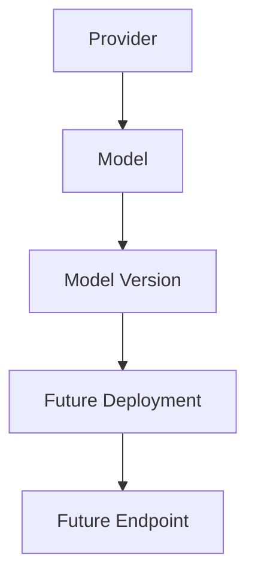
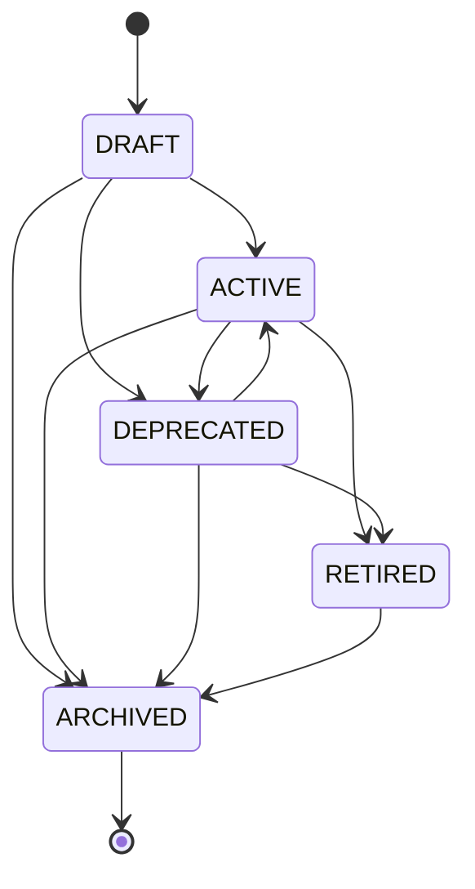
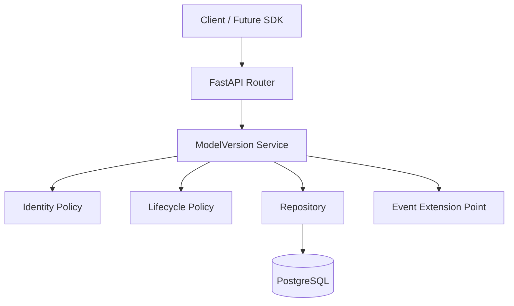
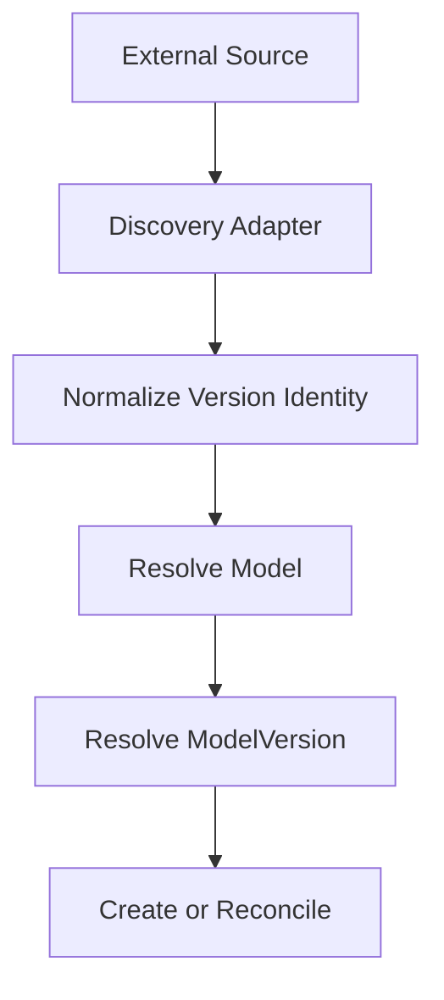
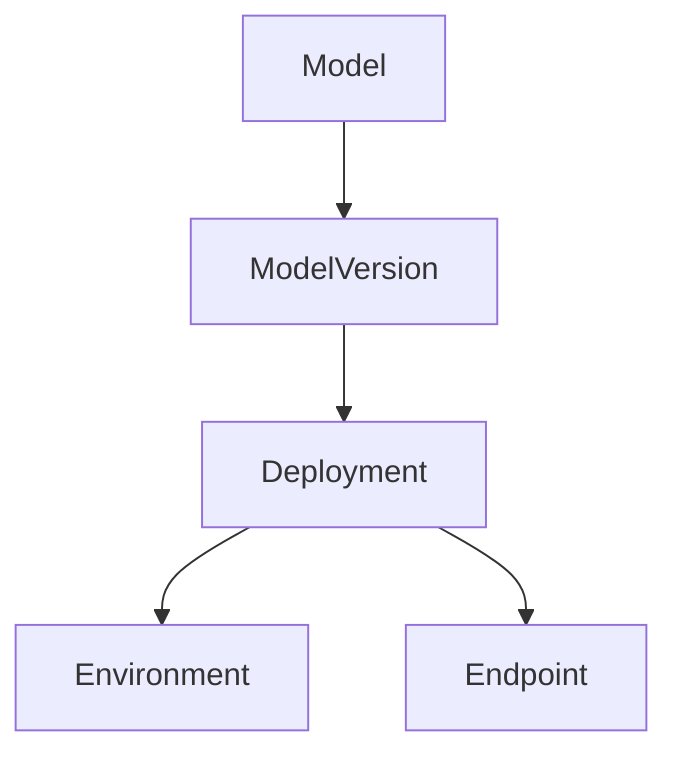

# Auditra — AI Model Inventory / Model Versioning Specification

**Document type:** Authoritative implementation specification for coding, testing, review, and completion  
**Platform:** Auditra  
**Feature:** AI Model Inventory  
**Sub-feature:** 2. Model Versioning  
**Implementation stage:** V1  
**Prerequisite:** AI Model Inventory / Model Registration V1  
**Backend style:** Modular monolith  
**Primary backend:** Python 3.11+, FastAPI, Pydantic, SQLAlchemy, Alembic  
**Primary persistence:** PostgreSQL  
**Optional infrastructure:** Redis, RustFS  
**Frontend:** Out of scope  
**Execution target:** OpenCode coding agent  
**Status:** Ready for implementation

---

## 1. Executive Summary

Auditra's **AI Model Inventory** is the foundational registry for AI models and the governance metadata attached to those models.

The first AI Model Inventory sub-feature, **Model Registration**, establishes the stable logical identity of an AI model. The second sub-feature, **Model Versioning**, extends that identity with a first-class representation of concrete model revisions.

The core domain distinction is:

```text
Provider
    ↓
Model
    ↓
Model Version
    ↓
Future Deployment
    ↓
Future Endpoint
```

A `Model` answers:

> What logical AI model is this?

A `ModelVersion` answers:

> Which concrete revision of that logical model is this?

A `Deployment` will later answer:

> Where/how is this exact version being run?

An `Endpoint` will later answer:

> Through which access point can the deployment be reached?

Model Versioning must therefore remain a distinct bounded capability. It must not become a deployment registry, model-serving system, model-discovery system, evaluation system, or complete audit system.

### V1 outcome

The V1 implementation must provide a durable PostgreSQL-backed `ModelVersion` entity with:

- stable UUID identity;
- immutable identity-bearing fields;
- deterministic canonical version identity;
- provider/source-native identifiers;
- flexible version metadata;
- lifecycle management;
- duplicate prevention;
- tenant isolation;
- searchable/listable versions;
- archive semantics;
- clean FastAPI APIs;
- service/repository separation;
- migration support;
- unit, integration, API, and concurrency tests;
- extension points for future Deployment, Discovery, Usage, Evaluation, and Audit.

The implementation must remain simple enough for local Docker Compose while being structurally suitable for future enterprise evolution.

---

## 2. Context and Dependencies

Auditra is being implemented using an incremental methodology:

```text
ONE MAIN FEATURE
        ↓
ONE SUB-FEATURE
        ↓
RESEARCH
        ↓
ARCHITECTURE
        ↓
SPECIFICATION
        ↓
IMPLEMENTATION
        ↓
TESTING
        ↓
REVIEW
        ↓
GIT COMMIT
        ↓
GIT PUSH
        ↓
NEXT SUB-FEATURE
```

The AI Model Inventory roadmap is:

```text
AI Model Inventory
│
├── 1. Model Registration              ← prerequisite / existing
│   ├── Model CRUD
│   ├── Provider
│   ├── Model Type
│   ├── Metadata
│   └── Ownership
│
├── 2. Model Versioning                ← CURRENT TASK
│   ├── Versions
│   ├── Version metadata
│   └── Lifecycle
│
├── 3. Model Deployment                ← future
│   ├── Deployment
│   ├── Environment
│   └── Endpoint
│
├── 4. Application / Agent Association ← future
│   ├── Application
│   ├── Agent
│   └── Model ↔ Agent relationship
│
├── 5. Model Usage                     ← future
│   ├── Usage events
│   ├── Request metadata
│   └── Basic statistics
│
├── 6. Model Discovery                 ← future
│   ├── Manual
│   ├── LangChain
│   ├── LangGraph
│   └── Future connectors
│
└── 7. Audit                            ← future
    ├── Created
    ├── Updated
    ├── Registered
    └── Deployment changes
```

### Dependency rule

Model Versioning depends on a stable `Model` identity from Model Registration.

It must **reuse** the existing model entity, repository, tenant context, database infrastructure, API conventions, exception conventions, and testing patterns where available.

It must not recreate Model Registration infrastructure.

---

## 3. Feature Purpose

Model Versioning provides concrete, governance-relevant identities for revisions of a logical model.

It enables questions such as:

- What versions exist for a model?
- Which provider/source identifier represents a version?
- Which version is active?
- Which versions are deprecated?
- Which versions are retired?
- What metadata belongs to version `X`?
- Which source registered the version?
- Was a version created manually or imported?
- Which exact version should a future Deployment reference?
- Which exact version was evaluated?
- Which exact version generated a future usage event?
- Can duplicate version records be created accidentally?

This is a governance capability, not merely a numbering system.

---

## 4. Goals

### 4.1 Functional goals

The implementation must:

1. Create ModelVersion records.
2. Retrieve a ModelVersion by UUID.
3. List versions for one model.
4. Search versions.
5. Filter versions.
6. Sort versions.
7. Update permitted descriptive metadata.
8. Manage version lifecycle.
9. Archive versions rather than physically delete them by default.
10. Prevent duplicate canonical version registration.
11. Preserve immutable version identity.
12. Support provider-native version identifiers.
13. Support source-native revision identifiers.
14. Support opaque identifiers.
15. Support semantic versions without requiring them.
16. Support date-based versions.
17. Support revision hashes and checkpoint identifiers.
18. Preserve tenant isolation.
19. Provide a future-compatible source/provenance field.
20. Provide future-compatible audit events.
21. Provide clean FastAPI contracts.
22. Provide database migration support.
23. Provide automated tests.
24. Support future references from Deployment, Usage, Evaluation, and Discovery.

### 4.2 Architectural goals

The implementation must be:

- modular;
- provider-agnostic;
- framework-agnostic at the domain level;
- runtime-agnostic;
- PostgreSQL-first;
- cloud-neutral;
- self-hostable;
- open-source friendly;
- testable;
- observable through existing logging conventions;
- minimally coupled;
- extensible without excessive normalization.

---

## 5. Non-Goals

The following are explicitly outside this implementation:

- Model Deployment;
- Environment management;
- Endpoint management;
- Runtime inventory;
- Application registration;
- Agent registration;
- Workflow registration;
- Usage event collection;
- token tracking;
- cost tracking;
- model discovery;
- LangChain discovery adapters;
- LangGraph discovery adapters;
- provider synchronization;
- evaluation;
- risk scoring;
- compliance;
- security governance;
- full audit storage/query platform;
- artifact repository;
- model cards;
- model serving;
- model execution;
- training pipelines;
- fine-tuning pipelines;
- AI/ML BOM generation;
- supply-chain governance;
- Kafka/event streaming;
- Kubernetes;
- microservices;
- Elasticsearch/OpenSearch;
- vector databases;
- frontend pages/components.

Future concepts may be documented as extension points, but they must not be implemented as part of this feature.

---

## 6. AI Model Inventory Structure

The full conceptual feature remains:

```text
AUDITRA
│
└── AI Model Inventory
    │
    ├── 1. Model Registration
    │   ├── Model CRUD
    │   ├── Provider
    │   ├── Model Type
    │   ├── Metadata
    │   └── Ownership
    │
    ├── 2. Model Versioning
    │   ├── Versions
    │   ├── Version metadata
    │   └── Lifecycle
    │
    ├── 3. Model Deployment
    │   ├── Deployment
    │   ├── Environment
    │   └── Endpoint
    │
    ├── 4. Application / Agent Association
    │   ├── Application
    │   ├── Agent
    │   └── Model ↔ Agent relationship
    │
    ├── 5. Model Usage
    │   ├── Usage events
    │   ├── Request metadata
    │   └── Basic statistics
    │
    ├── 6. Model Discovery
    │   ├── Manual
    │   ├── LangChain
    │   ├── LangGraph
    │   └── Future connectors
    │
    └── 7. Audit
        ├── Created
        ├── Updated
        ├── Registered
        └── Deployment changes
```

Only item **2. Model Versioning** is implemented by this specification.

---

## 7. Model Registration Dependency

Model Registration is the prerequisite.

The expected existing model entity provides, at minimum:

- `model.id` — stable UUID;
- tenant scope;
- provider association;
- model type;
- canonical model identity;
- lifecycle state;
- archive state;
- common timestamps.

The coding agent must inspect the actual repository before coding.

### Required behavior

A version may be created only under a valid parent Model.

Normal creation must reject an archived parent Model.

A ModelVersion must never be reassigned from one Model to another.

```text
ModelVersion.model_id = immutable
```

---

## 8. Critical Domain Distinction

The implementation MUST preserve the following semantics.

### Provider

The organization/provider that supplies, hosts, or identifies the model service.

Examples:

```text
OpenAI
Anthropic
Google
Meta
Hugging Face
Ollama
vLLM
Internal
```

### Model

The stable logical AI model registered in Auditra.

Example:

```text
Model = company-support-llama
```

### ModelVersion

A concrete revision of that Model.

Example:

```text
Model = company-support-llama
Version = v2.1.0
```

### Deployment

A future running/operational instance of a specific ModelVersion.

### Endpoint

A future network or API access point to a Deployment.

### Runtime

A future software/infrastructure mechanism that serves a Deployment.

### Application / Agent / Workflow

Consumers/orchestrators that use one or more model versions.

### Usage

Future evidence that a model/version was actually invoked.

### Audit

Historical governance evidence about changes to the records.

The relationship is:



---

## 9. Model Version Entity

`ModelVersion` is a first-class domain entity.

The entity represents an immutable identity-bearing revision under one Model.

Conceptually:

```text
Model
  ├── ModelVersion A
  ├── ModelVersion B
  └── ModelVersion C
```

A Model may contain zero, one, or many versions.

A ModelVersion cannot exist independently of its parent Model.

The preferred cardinality is:

```text
Model 1 ────── N ModelVersion
```

---

## 10. Model vs Model Version Identity

### Model identity

The Model has:

```text
model.id
model.canonical_key
```

The internal `model.id` is the authoritative Auditra reference.

### Version identity

The ModelVersion has:

```text
model_version.id
model_version.canonical_version_key
```

The internal version UUID is the authoritative Auditra reference to the concrete revision.

### Combined identity

Conceptually:

```text
Model canonical identity
        +
Version canonical identity
        ↓
Concrete governed revision
```

The version must not replace the parent Model identity.

---

## 11. Version Identity Strategy

The specification uses multiple identity layers because external model ecosystems do not use one universal version scheme.

### Identity layers

1. **Auditra Model UUID**
2. **Auditra ModelVersion UUID**
3. **Model canonical identity**
4. **Version canonical identity**
5. **Provider-native model identifier**
6. **Provider/source-native version identifier**
7. **Human-readable version label**
8. **Source reference**

### Recommended canonical version key

Use an explicit, deterministic string field:

```text
canonical_version_key
```

The key is generated by a dedicated service, not by route logic.

The preferred identity precedence is:

```text
Provider/source immutable revision ID
        >
Provider-native immutable release/version ID
        >
Explicit Auditra identity key
        >
Human-readable version label
```

The exact precedence may be adjusted for a provider-specific adapter later, but the rule must remain deterministic.

---

## 12. Version Identity Types

Use an extensible string taxonomy rather than assuming one version format.

Recommended conceptual identity types:

```text
native
revision
release
checkpoint
label
opaque
```

A provider-specific revision can therefore be represented as:

```text
identity_type = revision
native_version_id = abc123def456
```

An internal semantic release can be:

```text
identity_type = release
version_label = v2.1.0
```

An opaque provider identifier can be:

```text
identity_type = opaque
native_version_id = provider-generated-id
```

The V1 database should not use a PostgreSQL enum for this because new versioning schemes may be introduced by future connectors.

Application-level validation or a lookup-backed taxonomy is preferable.

---

## 13. Canonical Version Key

The canonical version key is the deterministic representation used for duplicate prevention and stable lookup.

### Example

For a native identifier:

```text
identity_type = native
native_version_id = 2025-04-14
```

The canonical key may be:

```text
native:2025-04-14
```

For a revision:

```text
identity_type = revision
native_version_id = abc123
```

The canonical key may be:

```text
revision:abc123
```

For a label-only version:

```text
identity_type = label
version_label = v1.2.0
```

The canonical key may be:

```text
label:v1.2.0
```

The exact prefixes are implementation details; what matters is that the algorithm is deterministic, documented, and tested.

---

## 14. Version Normalization

The version identity service must normalize input before constructing the canonical key.

At minimum:

- trim surrounding whitespace;
- reject empty identifiers;
- normalize the identity type to a stable lowercase representation;
- preserve provider-native case where it may be semantically significant;
- avoid destructive normalization of opaque identifiers;
- normalize only what is known to be semantically safe;
- make repeated normalization produce the same result.

### Important rule

Do not blindly lowercase all version identifiers.

For example, a provider or internal system may treat:

```text
ABC123
```

and:

```text
abc123
```

as different identifiers.

Provider-specific normalization may later be delegated to adapters.

---

## 15. Duplicate Detection

The authoritative duplicate rule is:

```text
same tenant
+
same model
+
same canonical_version_key
```

A duplicate version registration must produce a conflict.

### Application-level check

The service should perform a lookup before insert so that it can return a meaningful domain error.

### Database-level check

The database must enforce the same rule with a unique constraint or unique index.

This is mandatory because application checks are not safe against concurrent requests.

### Race example

```text
Request A                 Request B
---------                 ---------
check key → absent        check key → absent
insert                    insert
commit                    conflict
```

One transaction succeeds; the other must fail cleanly with a deterministic conflict response.

### Recommended constraint

```text
UNIQUE (tenant_id, model_id, canonical_version_key)
```

---

## 16. Version Immutability

Version identity must be immutable after creation.

### Immutable fields

Recommended:

```text
id
tenant_id
model_id
identity_type
native_version_id
canonical_version_key
```

`version_label` should also be treated as identity-bearing and immutable in V1 when it is used as the only identity source.

### Mutable fields

Recommended mutable fields:

```text
display_name
description
metadata
source_reference
documentation_reference (if included)
governance_notes (if included)
```

Lifecycle state is mutable only through explicit lifecycle operations.

### Why

Future entities may refer to:

```text
Deployment → ModelVersion
Evaluation → ModelVersion
UsageEvent → ModelVersion
AuditEvent → ModelVersion
```

Changing the identity of a version after references exist would make historical data ambiguous.

---

## 17. Version Naming and Version Schemes

Auditra must not force all model providers into semantic versioning.

Potential schemes include:

| Scheme | Example |
|---|---|
| Semantic version | `v2.1.0` |
| Date version | `2025-04-14` |
| Native release | `release-17` |
| Revision hash | `abc123...` |
| Checkpoint | `checkpoint-0042` |
| Opaque provider ID | `model-release-8f1...` |
| Internal ordinal | `42` |

### V1 recommendation

Treat the version identifier as an **opaque identity**, with optional semantic interpretation metadata.

Do not require a universal comparator.

For ordering, V1 should primarily use:

- `created_at`;
- `updated_at`;
- label as requested.

A future version-scheme subsystem may provide semantic comparison when needed.

---

## 18. Example: External Provider Versions

### Example A — Date-based provider revision

```text
Provider: OpenAI
Model: model-family
Version:
  identity_type = native
  native_version_id = 2025-04-14
```

### Example B — Hugging Face repository revision

```text
Provider: Hugging Face
Model: organization/model
Version:
  identity_type = revision
  native_version_id = abc123def456...
```

Hugging Face supports resolving a branch/tag/PR reference to a commit hash and using that resolved revision to pin subsequent downloads to one exact repository state. This reinforces the value of storing both the requested revision label and, when available, a resolved immutable revision identifier. citehttps://huggingface.co/docs/huggingface_hub/en/package_reference/hf_api

### Example C — Internal semantic version

```text
Provider: Internal
Model: uav-vision
Version:
  identity_type = release
  version_label = v2.1.0
```

### Example D — Checkpoint

```text
Provider: Internal
Model: fraud-detector
Version:
  identity_type = checkpoint
  native_version_id = checkpoint-0042
```

The same Auditra model-version architecture supports all four cases.

---

## 19. Version Metadata

Version metadata should contain information that describes the concrete revision but does not define its primary relational identity.

### First-class fields

Use relational columns for attributes that are:

- stable;
- constrained;
- identity-bearing;
- frequently queried;
- essential for relationships;
- required for lifecycle behavior.

### JSONB metadata

Use JSONB for flexible provider/domain-specific attributes such as:

```json
{
  "parameter_count": 7000000000,
  "context_window": 128000,
  "modalities": ["text", "vision"],
  "license": "internal",
  "framework": "pytorch",
  "quantization": "int4",
  "architecture": "transformer",
  "training_cutoff": "2025-01",
  "revision_sha": "abc123"
}
```

### Metadata rule

```text
Stable + queried + constrained
        → PostgreSQL column

Provider/domain-specific + flexible
        → JSONB

Large/unstructured
        → future RustFS/object storage
```

Do not duplicate authoritative relational fields inside JSONB.

Bad:

```json
{
  "model_id": "...",
  "lifecycle_state": "ACTIVE",
  "version": "v2"
}
```

when those fields already exist as authoritative columns.

---

## 20. Recommended ModelVersion Fields

The implementation should evaluate the following fields and use the subset justified by the repository's existing conventions:

| Field | Required | Purpose |
|---|---:|---|
| `id` | Yes | Stable UUID |
| `tenant_id` | Yes | Tenant boundary |
| `model_id` | Yes | Parent Model FK |
| `identity_type` | Yes | Version identity scheme |
| `version_label` | Yes | Human-readable version identifier |
| `native_version_id` | No | Provider/source-native identifier |
| `canonical_version_key` | Yes | Duplicate/identity key |
| `display_name` | No | Friendly name |
| `description` | No | Description |
| `lifecycle_state` | Yes | Version lifecycle |
| `metadata` | Yes | Flexible non-secret metadata |
| `source_type` | Yes | Registration origin |
| `source_reference` | No | External source record |
| `created_at` | Yes | UTC creation time |
| `updated_at` | Yes | UTC update time |
| `archived_at` | No | Archive time |
| `created_by` | No | Future actor identity |
| `updated_by` | No | Future actor identity |
| `record_version` | Yes | Optimistic concurrency |

The coding agent must not blindly add every field if the existing Model Registration architecture already provides a consistent alternative.

---

## 21. PostgreSQL Design

### 21.1 V1 table

The minimum new V1 persistence structure should be:

```text
model_versions
```

No separate deployment, endpoint, artifact, evaluation, usage, or lineage tables should be created by this task.

### 21.2 Suggested schema

```text
model_versions
--------------
id                       UUID           PK
 tenant_id               UUID           NOT NULL
 model_id                UUID           NOT NULL FK -> models.id
 identity_type           VARCHAR(64)    NOT NULL
 version_label           VARCHAR(255)   NOT NULL
 native_version_id       VARCHAR(512)   NULL
 canonical_version_key   VARCHAR(1024)  NOT NULL
display_name             VARCHAR(255)   NULL
description              TEXT           NULL
lifecycle_state          VARCHAR(32)    NOT NULL
metadata                 JSONB          NOT NULL DEFAULT '{}'
source_type              VARCHAR(64)    NOT NULL
source_reference         VARCHAR(512)   NULL
created_at               TIMESTAMPTZ    NOT NULL
updated_at               TIMESTAMPTZ    NOT NULL
archived_at              TIMESTAMPTZ    NULL
created_by               UUID/text      NULL
updated_by               UUID/text      NULL
record_version           BIGINT         NOT NULL DEFAULT 1
```

The exact audit actor type must follow existing Auditra conventions.

---

## 22. Foreign Key and Deletion Rules

Required relationship:

```text
model_versions.model_id
        ↓
models.id
```

Recommended foreign-key delete behavior:

```text
ON DELETE RESTRICT
```

or the equivalent application-level policy.

A Model must not be physically removed in a way that silently destroys version history.

Normal ModelVersion deletion is archive semantics.

---

## 23. Database Constraints

At minimum:

```text
PRIMARY KEY (id)
FOREIGN KEY (model_id) REFERENCES models(id)
UNIQUE (tenant_id, model_id, canonical_version_key)
NOT NULL on required identity fields
```

Additional constraints may validate known lifecycle values if the project's convention permits it.

Do not use database enums for open-ended version identity types unless the project has already standardized on them and the migration cost is accepted.

---

## 24. Database Indexes

Recommended indexes should support actual V1 access patterns.

Primary list query:

```text
List versions for one model in one tenant ordered by created_at DESC
```

Recommended indexes:

```text
(tenant_id, model_id, created_at DESC)
(tenant_id, model_id, lifecycle_state)
(tenant_id, model_id, updated_at DESC)
(tenant_id, model_id, version_label)
(tenant_id, model_id, native_version_id)
UNIQUE (tenant_id, model_id, canonical_version_key)
```

Do not index every JSONB property.

Add a JSONB GIN index only after an actual query requirement is demonstrated.

---

## 25. Timestamps and Time Handling

Use timezone-aware PostgreSQL `TIMESTAMPTZ`.

Store timestamps in UTC.

Required:

```text
created_at
updated_at
```

Optional:

```text
archived_at
```

Do not use application-local naive datetimes for persisted business records.

---

## 26. Soft Delete / Archive Semantics

ModelVersion is historical governance data.

Therefore, normal DELETE must mean archive rather than physical deletion.

```text
DELETE
   ↓
ARCHIVED
   ↓
archived_at = now()
```

### Default list behavior

Archived versions should be excluded by default.

An explicit:

```text
include_archived=true
```

or the repository's equivalent may return them.

### Archived version mutation

By default, archived versions should not be updated except through a specifically supported restore process.

V1 should preferably not provide restore unless the existing platform already has a standardized restore mechanism.

### Historical integrity

Never recycle an archived UUID.

Never reuse a canonical version key for a different revision.

---

## 27. Parent Model Archive Interaction

When the parent Model is archived:

- no new versions may be created under it;
- existing versions remain historical records;
- active-list queries should respect parent archive state;
- version records should not be physically deleted;
- version history should remain queryable under explicit historical access rules.

Do not automatically rewrite every version lifecycle state simply because the Model is archived unless the existing domain policy explicitly requires cascading lifecycle behavior.

V1 recommendation:

> Keep Model and ModelVersion lifecycle histories independent, while preventing new versions under an archived parent.

---

## 28. Version Lifecycle

Recommended V1 states:

```text
DRAFT
ACTIVE
DEPRECATED
RETIRED
ARCHIVED
```

### State definitions

#### DRAFT

Registered but not yet considered active for operational use.

#### ACTIVE

Approved/currently usable in an organizational context.

#### DEPRECATED

Still registered and potentially usable, but should not be selected for new workloads.

#### RETIRED

No longer intended for operational use.

#### ARCHIVED

Retained for historical governance purposes and no longer normally mutable.

---

## 29. Lifecycle State Machine

Recommended V1 transitions:



### Invalid examples

Reject:

```text
ARCHIVED → ACTIVE
RETIRED → DRAFT
RETIRED → ACTIVE
```

unless a future explicit policy changes the state machine.

---

## 30. Lifecycle Service

Lifecycle rules must be centralized in a service/policy component.

Conceptual interface:

```text
can_transition(current_state, target_state)
validate_transition(current_state, target_state)
transition(version, target_state)
```

The API router must never contain the full transition matrix.

### Initial state

Recommended initial state:

```text
DRAFT
```

This avoids silently asserting that a manually created version is immediately production-ready.

If the existing Model Registration workflow has an established convention that requires immediate `ACTIVE`, the coding agent may align with that convention, but it must document the choice.

---

## 31. Model Lifecycle vs Version Lifecycle

These are separate lifecycle dimensions.

Example:

```text
Model:
    ACTIVE

Version 1:
    RETIRED

Version 2:
    ACTIVE

Version 3:
    DRAFT
```

This is valid.

### V1 recommendation

Do not automatically synchronize the Model lifecycle and Version lifecycle.

Instead:

- parent Model must be non-archived to create a version;
- ModelVersion has its own state;
- Model Registration rules continue to own Model lifecycle;
- Versioning rules own version lifecycle.

This avoids coupling the registry to future deployment semantics.

---

## 32. Multiple Active Versions

V1 should allow multiple `ACTIVE` versions for the same Model.

Example:

```text
Model: customer-support-llm

Version 1.0 → ACTIVE
Version 1.1 → ACTIVE
Version 2.0 → DRAFT
```

### Reason

Organizations may operate multiple versions simultaneously across:

- environments;
- regions;
- applications;
- migration periods;
- rollback windows;
- separate teams.

A strict “exactly one ACTIVE version” rule would couple registry semantics to deployment semantics.

### Deployment implication

Future Deployment should decide which version is operational in a particular environment.

---

## 33. Current Version Strategy

Do **not** add `current_version_id` to the Model by default in V1.

### Reason

“Current” can mean different things:

- globally current;
- production current;
- staging current;
- region current;
- application current;
- agent current.

A future Deployment/Environment layer is the correct place to resolve operational selection.

### Optional future approach

A future alias or environment-specific pointer could support:

```text
production → ModelVersion 4
staging    → ModelVersion 5
```

but that is not part of Model Versioning V1.

MLflow demonstrates the usefulness of mutable model-version aliases for operational selection, while keeping the underlying model version identifiable separately. Auditra should preserve the separation while leaving alias/deployment semantics for a future layer. citehttps://www.mlflow.org/docs/latest/registry/

---

## 34. Version Aliases

Do not implement a generalized version-alias subsystem in V1 unless an existing Auditra convention already provides a reusable primitive.

Potential future aliases include:

```text
champion
production
staging
challenger
latest
```

Such aliases should be mutable pointers, not identity fields.

If implemented later, they should never change the underlying ModelVersion identity.

---

## 35. Provider-Specific Version Identity

Auditra must support providers that expose different identity models.

Examples:

### Cloud API provider

```text
Model:
    gpt-family

Version:
    provider-dated-release
```

### Repository-based provider

```text
Model:
    org/model

Version:
    commit/revision SHA
```

### Local runtime

```text
Provider:
    Ollama

Model:
    local-model

Version:
    local provider identifier
```

### Internal model

```text
Provider:
    Internal

Model:
    uav-vision

Version:
    v2.1.0
```

The core version table must remain provider-agnostic.

Provider-specific interpretation may later live in discovery/provider adapter modules.

---

## 36. Source / Registration Origin

V1 should retain lightweight provenance.

Recommended `source_type` examples:

```text
manual
import
```

Future values may include:

```text
discovery
langchain
langgraph
connector
```

The application must not implement those future connectors now.

### `source_reference`

This field may hold an external reference, such as:

```text
external registry ID
repository reference
import record ID
connector source ID
```

It must not contain credentials or secrets.

---

## 37. Ownership

A ModelVersion normally inherits governance ownership from its parent Model.

Conceptually:

```text
Model Owner / Team
        ↓
ModelVersion
```

### V1 recommendation

Do not create a separate version ownership domain.

The parent model remains the default responsible asset.

A future identity system may provide:

```text
Organization
   ↓
Tenant
   ↓
Team
   ↓
User / Service Identity
   ↓
Model
   ↓
ModelVersion
```

Version-specific ownership should be introduced only when an actual business requirement exists.

---

## 38. Tenant Readiness

Auditra is intended for enterprise use.

Every ModelVersion record must therefore be tenant-scoped.

### Requirements

- every repository query requires tenant context;
- every `model_id` lookup is tenant-scoped;
- every version lookup is tenant-scoped;
- unique identity is tenant-scoped;
- cross-tenant access must not reveal resource existence;
- service methods must not silently query all tenants.

### Recommended constraint

```text
UNIQUE (tenant_id, model_id, canonical_version_key)
```

Do not implement a full tenant administration subsystem here.

---

## 39. FastAPI Architecture

The module must fit into the existing modular monolith.

Recommended conceptual architecture:



### Responsibilities

#### Router/API

- HTTP parsing;
- request validation;
- tenant/auth context resolution;
- service invocation;
- error translation.

#### Service

- business rules;
- parent model validation;
- duplicate handling;
- lifecycle transitions;
- immutable-field enforcement;
- archive behavior.

#### Repository

- persistence;
- query composition;
- transaction-facing DB operations.

#### Identity policy

- normalization;
- canonical key generation.

#### Lifecycle policy

- state definitions;
- transition validation.

---

## 40. API Resource Design

Preferred base path:

```text
/api/v1
```

Preferred nested resource:

```text
/models/{model_id}/versions
```

This makes the parent-child relationship explicit.

The exact route naming must follow Model Registration conventions already present in the repository.

---

## 41. API Specification

### 41.1 Create ModelVersion

```http
POST /api/v1/models/{model_id}/versions
```

Purpose:

Create a version under a registered Model.

Request schema:

```text
ModelVersionCreate
```

Success:

```http
201 Created
```

Potential errors:

```text
400 Bad Request
404 Not Found
409 Conflict
422 Unprocessable Entity
```

Conflict example:

```text
MODEL_VERSION_ALREADY_EXISTS
```

---

### 41.2 List ModelVersions

```http
GET /api/v1/models/{model_id}/versions
```

Supported parameters should include:

```text
page
page_size
search
lifecycle_state
identity_type
source_type
include_archived
sort_by
sort_order
```

Recommended defaults:

```text
page=1
page_size=20
sort_by=created_at
sort_order=desc
include_archived=false
```

Success:

```http
200 OK
```

---

### 41.3 Get ModelVersion

```http
GET /api/v1/models/{model_id}/versions/{version_id}
```

The service must verify that the version belongs to the supplied model and tenant.

Success:

```http
200 OK
```

Unknown or unauthorized resources should use the existing project's safe not-found behavior.

---

### 41.4 Update ModelVersion metadata

```http
PATCH /api/v1/models/{model_id}/versions/{version_id}
```

Allowed changes should be limited to mutable descriptive metadata.

Identity-bearing fields must not be modifiable.

Success:

```http
200 OK
```

Stale optimistic-concurrency updates should return the project's conflict response, preferably:

```http
409 Conflict
```

---

### 41.5 Lifecycle transition

```http
POST /api/v1/models/{model_id}/versions/{version_id}/lifecycle
```

Request:

```json
{
  "target_state": "ACTIVE"
}
```

Success:

```http
200 OK
```

Invalid transition:

```http
409 Conflict
```

---

### 41.6 Archive

```http
DELETE /api/v1/models/{model_id}/versions/{version_id}
```

The DELETE operation means archive.

Success may follow the project's existing convention:

```http
204 No Content
```

or an archive response body if Model Registration already uses one.

Physical deletion is not permitted through the normal public API.

---

## 42. API Idempotency

### Create

Create is not inherently idempotent by HTTP method, but duplicate identity must behave predictably.

The recommended behavior is:

- first request with a new canonical key → create;
- repeat request with same identity → `409 Conflict` unless the platform already standardizes an idempotent-key mechanism.

Do not silently create a second version.

### Lifecycle

Repeated transition to the current state should either:

- return the current resource without change; or
- follow the existing project's idempotency convention.

The behavior must be explicit and tested.

---

## 43. Pydantic Schemas

Recommended schemas:

```text
ModelVersionCreate
ModelVersionUpdate
ModelVersionResponse
ModelVersionListItem
ModelVersionListResponse
ModelVersionLifecycleUpdate
```

Optional:

```text
ModelVersionArchiveResponse
```

only if consistent with the existing API.

### Separation rule

```text
Pydantic schema
    ≠
SQLAlchemy model
    ≠
Domain entity
```

Keep them conceptually separate.

---

## 44. ModelVersionCreate Schema

Conceptual request:

```json
{
  "identity_type": "native",
  "version_label": "2025-04-14",
  "native_version_id": "2025-04-14",
  "display_name": "April 2025 Release",
  "description": "Provider release tracked by Auditra",
  "metadata": {
    "context_window": 128000
  },
  "source_type": "manual",
  "source_reference": null
}
```

The request should not accept server-owned fields such as:

```text
id
tenant_id
created_at
updated_at
archived_at
record_version
canonical_version_key
```

Canonical identity should be generated by the service.

---

## 45. ModelVersionUpdate Schema

Allowed fields may include:

```text
display_name
description
metadata
source_reference
```

Potentially mutable governance notes may be added if required by the existing domain convention.

Reject or ignore immutable fields according to the established API validation policy, but do not silently mutate them.

Recommended explicit rejection for attempts to alter:

```text
model_id
identity_type
native_version_id
canonical_version_key
version_label
```

---

## 46. Lifecycle Request Schema

Conceptually:

```json
{
  "target_state": "DEPRECATED"
}
```

The service must:

1. load the version;
2. verify tenant and parent model;
3. check current state;
4. validate transition;
5. persist state;
6. update timestamps/version;
7. emit lifecycle extension event.

---

## 47. Service Layer

Recommended service methods:

```text
create_version()
get_version()
list_versions()
update_version_metadata()
transition_version()
archive_version()
```

### Create flow

```text
API
 ↓
validate request
 ↓
resolve tenant
 ↓
load parent Model
 ↓
verify Model not archived
 ↓
build canonical version key
 ↓
check duplicate
 ↓
construct domain entity
 ↓
persist
 ↓
commit
 ↓
emit event extension point
 ↓
return response
```

### Update flow

```text
API
 ↓
load version
 ↓
verify tenant
 ↓
verify parent model relationship
 ↓
reject identity mutations
 ↓
validate mutable fields
 ↓
persist with concurrency check
 ↓
commit
 ↓
emit event
```

### Lifecycle flow

```text
API
 ↓
load version
 ↓
validate state transition
 ↓
update lifecycle + timestamp + record_version
 ↓
commit
 ↓
emit lifecycle event
```

---

## 48. Repository Layer

Recommended methods:

```text
create()
get_by_id()
get_by_model_and_id()
get_by_canonical_key()
list_by_model()
exists_by_canonical_key()
count_by_model()
update_metadata()
update_lifecycle()
archive()
```

The repository must not decide business policy such as whether `RETIRED → ACTIVE` is allowed.

The repository must not generate canonical identity.

The repository must not bypass tenant filtering.

---

## 49. Querying, Search, Filter, Sort and Pagination

### Supported filters

- lifecycle state;
- identity type;
- source type;
- created date range;
- updated date range;
- include archived.

### Search fields

- version label;
- display name;
- native version ID;
- canonical version key.

### Sorting

Safe sort fields should be explicitly mapped:

```text
created_at
updated_at
version_label
lifecycle_state
```

Never interpolate arbitrary user input into SQL ordering clauses.

### Pagination

Reuse the Model Registration pagination contract.

Do not introduce cursor pagination solely for this feature.

---

## 50. Optimistic Concurrency

ModelVersion updates should reuse the existing Auditra concurrency pattern.

Preferred concept:

```text
record_version BIGINT
```

Update example:

```text
UPDATE model_versions
SET description = ?,
    record_version = record_version + 1,
    updated_at = ?
WHERE id = ?
  AND tenant_id = ?
  AND record_version = ?
```

If no row is updated because the version number is stale, return a concurrency conflict.

Do not introduce distributed locks for ordinary metadata changes.

---

## 51. Transaction Boundaries

Creation, lifecycle transitions, and archive operations must be transactional.

### Version creation transaction

```text
load parent Model
        +
validate identity
        +
insert ModelVersion
        +
commit
```

### Lifecycle transaction

```text
load current version
        +
validate transition
        +
update state
        +
commit
```

### Event handling

If an existing outbox/event foundation exists, use it.

If not, keep a small extension point rather than introducing Kafka.

---

## 52. Audit Extension Point

Auditra's broader inventory audit capability is future work.

For Model Versioning V1, expose lightweight events:

```text
model_version.created
model_version.updated
model_version.lifecycle_changed
model_version.archived
```

Conceptual payload:

```json
{
  "event_type": "model_version.created",
  "tenant_id": "...",
  "model_id": "...",
  "model_version_id": "...",
  "actor_id": "...",
  "timestamp": "2026-10-05T00:00:00Z",
  "source_type": "manual"
}
```

Do not implement the full Audit subsystem.

---

## 53. Discovery Extension Point

Future Model Discovery will support:

```text
Manual
LangChain
LangGraph
Future connectors
```

Discovery will eventually be able to produce/reconcile:

```text
Provider
Model
ModelVersion
```

Model Versioning must therefore keep identity deterministic and provenance-friendly.

Future flow:



No discovery connector is implemented by this task.

---

## 54. LangChain / LangGraph Integration Strategy

### V1

No LangChain or LangGraph runtime integration is required.

### Future

Future connectors may inspect:

```text
provider
model identifier
model configuration
revision/release identifier
```

and map them to:

```text
Auditra Model
Auditra ModelVersion
```

LangChain currently uses provider-qualified model specifications in parts of its ecosystem, and model integrations expose provider/model information through model initialization and response metadata. This supports keeping provider identity and model identity separate in Auditra rather than baking LangChain classes into the domain model. citehttps://docs.langchain.com/oss/python/deepagents/profiles

The Auditra domain must remain framework-neutral.

---

## 55. LiteLLM Compatibility Consideration

LiteLLM supports provider-qualified model strings and can route model identifiers through provider/gateway semantics. This is useful precedent for treating provider and model identifier as separate concepts. citehttps://docs.litellm.ai/docs/harness/models

Auditra should not adopt LiteLLM's model string as its internal canonical identity. Instead:

```text
provider_id
+
native model identifier
+
version identity
```

remain separate domain concepts.

---

## 56. OpenTelemetry / OpenInference Compatibility

Future observability integrations should be able to map runtime telemetry to Auditra model/version records.

OpenTelemetry GenAI semantic conventions distinguish provider and model-related attributes, including `gen_ai.provider.name`, request model, and response model. citehttps://opentelemetry.io/docs/specs/semconv/registry/attributes/gen-ai/

This supports the following Auditra design:

```text
Provider identity
        separate from
Model identity
        separate from
Version identity
```

V1 should only preserve compatibility at the data-model level.

Do not implement tracing in this feature.

---

## 57. MLflow and Model Registry Patterns

MLflow separates a registered model from individual model versions and supports version metadata, tags, aliases, descriptions, and lifecycle-oriented workflows. It also permits multiple versions under one registered model. citehttps://www.mlflow.org/docs/latest/registry/

Auditra should adopt the architectural principle of separating:

```text
Model
ModelVersion
```

but should not copy MLflow's entire lifecycle, deployment, or alias subsystem into V1.

MLflow's alias behavior is useful future inspiration for deployment-aware selection, but V1 should keep deployment concerns separate.

---

## 58. Kubeflow and Registry Separation

Kubeflow describes its registry as a metadata-oriented system for managing models, versions, and artifacts, with model catalog/discovery and deployment forming adjacent capabilities. citehttps://www.kubeflow.org/docs/components/hub/overview/

Auditra should preserve the same broad architectural separation:

```text
Registry metadata
        ≠
Deployment
        ≠
Discovery
```

Artifact handling remains future scope.

---

## 59. Hugging Face Revision Model

Hugging Face allows model repository revisions to be branch names, tags, pull-request refs, or commit hashes, and provides APIs to resolve a revision to an immutable commit hash. citehttps://huggingface.co/docs/huggingface_hub/en/package_reference/hf_api

This is directly relevant to Auditra because it demonstrates why a version record may need both:

```text
human/source revision reference
        +
resolved immutable revision identity
```

Auditra V1 does not need a complete Git/repository abstraction, but `native_version_id`, `source_reference`, and `metadata` should be sufficient extension points.

---

## 60. Artifact and Fingerprint Boundary

A concrete model version may eventually reference artifacts such as:

- weight files;
- checkpoint bundles;
- tokenizer assets;
- model cards;
- manifests;
- evaluation reports;
- configuration snapshots.

Potential future identifiers:

```text
sha256
artifact_digest
revision_hash
checkpoint_hash
signed_manifest
```

V1 should not create an Artifact table unless a real artifact workflow already exists in the repository.

A future Artifact entity may reference:

```text
artifact.model_version_id
```

### RustFS future role

RustFS may eventually store large objects, while PostgreSQL retains the authoritative version metadata and references.

---

## 61. Version Lineage

Potential future relationships include:

```text
Version B
    supersedes
Version A
```

and:

```text
Fine-tuned Version
    derived from
Base Version
```

### V1 recommendation

Do not add a lineage table.

Do not add `supersedes_version_id` unless an existing business requirement already exists.

Lineage can be added later without changing the fundamental ModelVersion identity design.

---

## 62. Fine-Tuned Model Strategy

A fine-tuned model can be governed in two ways depending on logical identity.

### Case A — New logical model

Use a new Model when the fine-tuned asset has independent governance identity.

```text
Base Model
    llama

Fine-tuned Model
    company-support-llama

Versions
    v1
    v2
```

### Case B — Same logical model, new revision

Use a new ModelVersion when the organization considers the release merely a new revision of the same logical model.

V1 should not attempt to infer this automatically.

The decision should remain an explicit registration decision until a future lineage/discovery policy exists.

---

## 63. Ownership and Governance Metadata

Version metadata may include governance notes such as:

```json
{
  "validation_status": "pending",
  "governance_note": "Pending security review"
}
```

But governance fields that later become stable and query-critical should eventually become structured entities or columns.

Do not build risk/evaluation systems here.

---

## 64. Security

### Tenant isolation

Every request must resolve a tenant context before accessing a ModelVersion.

### Parent-child authorization

Version access is subject to the authorization boundary of the parent Model.

### Input validation

Validate:

- UUIDs;
- text lengths;
- identity type;
- version label;
- native version ID;
- source type;
- metadata object shape;
- lifecycle state;
- pagination values;
- sort fields.

### SQL injection

Use SQLAlchemy parameterization.

Never concatenate user input into SQL expressions.

### Secrets

Never store:

- API keys;
- bearer tokens;
- provider secrets;
- passwords;
- certificates/private keys;
- secret URLs with credentials.

Metadata is not a secret manager.

---

## 65. Error Model

Reuse Model Registration's existing error contract.

Potential domain error codes:

```text
MODEL_NOT_FOUND
MODEL_ARCHIVED
MODEL_VERSION_NOT_FOUND
MODEL_VERSION_ALREADY_EXISTS
MODEL_VERSION_IDENTITY_IMMUTABLE
INVALID_MODEL_VERSION_LIFECYCLE_TRANSITION
MODEL_VERSION_ALREADY_ARCHIVED
INVALID_VERSION_IDENTITY
INVALID_VERSION_METADATA
VERSION_CONCURRENCY_CONFLICT
```

Example:

```json
{
  "error": {
    "code": "MODEL_VERSION_ALREADY_EXISTS",
    "message": "A model version with the same canonical identity already exists.",
    "details": {
      "model_id": "...",
      "canonical_version_key": "native:2025-04-14"
    }
  }
}
```

Do not leak information across tenant boundaries.

---

## 66. Redis Strategy

Redis is **not required** for Model Versioning V1 correctness.

The feature must operate correctly using:

```text
FastAPI
+
PostgreSQL
```

Potential future uses:

- caching hot version metadata;
- discovery/reconciliation jobs;
- distributed coordination;
- rate limiting;
- background task scheduling.

Do not add Redis calls to the critical persistence path without a demonstrated requirement.

---

## 67. RustFS Strategy

RustFS is **not required** for Model Versioning V1 correctness.

Version identity and structured metadata must remain in PostgreSQL.

Future RustFS use may include:

- model artifacts;
- checkpoint files;
- manifests;
- model cards;
- evidence documents;
- evaluation artifacts;
- provenance snapshots.

Do not make RustFS a dependency of the version CRUD workflow.

---

## 68. Observability

Do not implement a full observability subsystem.

Reuse existing application logging patterns.

Recommended operational events:

```text
model_version_created
model_version_updated
model_version_lifecycle_changed
model_version_archived
model_version_duplicate_rejected
```

Logs must not include credentials or sensitive metadata.

Future telemetry can use OpenTelemetry/OpenInference conventions without forcing them into V1 persistence.

---

## 69. Performance

V1 should be performant for ordinary enterprise inventory sizes without introducing distributed infrastructure.

Requirements:

- paginate all collection responses;
- index tenant/model access patterns;
- avoid N+1 queries;
- avoid unrestricted metadata scans;
- keep list payloads bounded;
- use efficient relationship loading;
- use database uniqueness rather than application-only duplicate checks.

Primary query:

```text
List all versions for one Model ordered by created_at DESC
```

The implementation should use a suitable composite index.

Do not optimize for hypothetical billions of versions before profiling shows a need.

---

## 70. FastAPI OpenAPI Requirements

The implementation must automatically expose the new schemas and endpoints via FastAPI.

Verify:

```text
/docs
/openapi.json
```

The generated OpenAPI should expose:

- create request schema;
- update request schema;
- response schema;
- list response schema;
- lifecycle request schema;
- validation errors;
- immutable field behavior through descriptions/documentation.

---

## 71. SQLAlchemy Requirements

Use the same SQLAlchemy style as Model Registration.

Conceptually:

```python
class ModelVersion(Base):
    __tablename__ = "model_versions"

    id = ...
    tenant_id = ...
    model_id = ...
    identity_type = ...
    version_label = ...
    native_version_id = ...
    canonical_version_key = ...
    display_name = ...
    description = ...
    lifecycle_state = ...
    metadata = ...
    source_type = ...
    source_reference = ...
    created_at = ...
    updated_at = ...
    archived_at = ...
    created_by = ...
    updated_by = ...
    record_version = ...
```

This is conceptual guidance, not permission to ignore existing project conventions.

Do not introduce another ORM.

---

## 72. Domain Layer Requirements

If the repository already uses domain entities/policies, add:

```text
ModelVersion entity
VersionLifecycle policy
VersionIdentity policy/service
```

The domain should not depend directly on FastAPI request objects.

The domain should not execute SQL.

The domain should remain testable without HTTP.

---

## 73. Repository Structure

Adapt to the current repository.

A likely structure is:

```text
backend/
└── app/
    └── modules/
        └── model_inventory/
            ├── api/
            │   └── versions.py
            ├── schemas/
            │   └── model_version.py
            ├── domain/
            │   ├── entities/
            │   │   └── model_version.py
            │   └── policies/
            │       └── model_version_lifecycle.py
            ├── services/
            │   ├── model_version_service.py
            │   └── model_version_identity_service.py
            ├── repositories/
            │   └── model_version_repository.py
            ├── models/
            │   └── model_version.py
            ├── events/
            │   └── model_version_events.py
            └── tests/
                ├── unit/
                ├── integration/
                └── api/
```

The exact paths are subordinate to existing repository conventions.

Do not reorganize unrelated modules.

---

## 74. Alembic Migration

Create a migration that:

1. creates `model_versions`;
2. adds the FK to `models`;
3. adds the required unique constraint;
4. adds query indexes;
5. adds required defaults;
6. uses timezone-aware timestamps;
7. supports clean upgrade;
8. supports clean downgrade;
9. preserves all existing Model Registration data.

Expected migration order:

```text
Model Registration migrations
        ↓
Model Versioning migration
        ↓
Future Deployment migration
```

The migration must not create future tables.

---

## 75. Docker Architecture

The feature should work with existing local Docker Compose infrastructure.

Expected minimum services:

```text
FastAPI
PostgreSQL
```

Redis and RustFS remain optional.

Expected workflow:

```text
Docker Compose
      ↓
PostgreSQL ready
      ↓
Alembic upgrade
      ↓
FastAPI starts
      ↓
Model Registration available
      ↓
Model Versioning available
```

Do not introduce a separate container or service for Model Versioning.

---

## 76. Testing Strategy

Testing is mandatory.

### 76.1 Unit tests

Test:

- identity normalization;
- canonical key generation;
- identity validation;
- lifecycle transitions;
- immutable fields;
- parent model validation;
- metadata validation;
- source type validation.

### 76.2 Repository/integration tests

Prefer real PostgreSQL integration tests for:

- creation;
- retrieval;
- list;
- filtering;
- sorting;
- uniqueness;
- foreign key integrity;
- archive;
- optimistic concurrency.

### 76.3 API tests

Test:

```text
POST create
GET individual
GET collection
PATCH update
POST lifecycle
DELETE archive
```

### 76.4 Negative tests

Must include:

- model missing;
- model archived;
- version missing;
- duplicate version;
- invalid version identity;
- invalid metadata;
- invalid lifecycle transition;
- immutable field mutation;
- cross-tenant access;
- invalid pagination;
- invalid sort.

### 76.5 Concurrency tests

Attempt concurrent creation of the same canonical version identity.

Expected behavior:

```text
one succeeds
one conflicts
```

The database must enforce correctness.

---

## 77. Test Matrix

| Scenario | Expected result |
|---|---|
| Create unique version | `201` |
| Create second unique version | `201` |
| Duplicate canonical identity | `409` |
| Get existing version | `200` |
| Get unknown version | `404` |
| List versions | `200` |
| Search version | `200` |
| Filter by state | `200` |
| Update description | `200` |
| Update metadata | `200` |
| Change `model_id` | Reject |
| Change `identity_type` | Reject |
| Change `native_version_id` | Reject |
| Change canonical key | Reject |
| Change version label when identity-bearing | Reject |
| DRAFT → ACTIVE | Allowed |
| ACTIVE → DEPRECATED | Allowed |
| DEPRECATED → ACTIVE | Allowed |
| DEPRECATED → RETIRED | Allowed |
| RETIRED → ACTIVE | Reject |
| ARCHIVED → ACTIVE | Reject |
| Archive version | Allowed |
| Create under archived Model | Reject |
| Cross-tenant read | Reject / safe 404 |
| Concurrent duplicate create | One success, one conflict |
| Stale metadata update | Concurrency conflict |

---

## 78. Example API Flow

### Create parent Model

Assume Model Registration has already created:

```text
model_id = 9bbd...
```

### Create version

```http
POST /api/v1/models/9bbd.../versions
Content-Type: application/json
```

```json
{
  "identity_type": "release",
  "version_label": "v2.1.0",
  "native_version_id": "release-210",
  "display_name": "Production Candidate",
  "description": "Second-generation internal release",
  "metadata": {
    "parameter_count": 13000000000,
    "framework": "pytorch",
    "quantization": "int4"
  },
  "source_type": "manual"
}
```

Response conceptually:

```json
{
  "id": "0fa0...",
  "tenant_id": "...",
  "model_id": "9bbd...",
  "identity_type": "release",
  "version_label": "v2.1.0",
  "native_version_id": "release-210",
  "canonical_version_key": "release:release-210",
  "display_name": "Production Candidate",
  "description": "Second-generation internal release",
  "lifecycle_state": "DRAFT",
  "metadata": {
    "parameter_count": 13000000000,
    "framework": "pytorch",
    "quantization": "int4"
  },
  "source_type": "manual",
  "created_at": "...",
  "updated_at": "..."
}
```

---

## 79. Future Deployment Relationship

The next major AI Model Inventory sub-feature will be Deployment.

The intended relationship is:

```text
Model
  ↓
ModelVersion
  ↓
Deployment
```

Future Deployment may contain:

- environment;
- runtime;
- region;
- infrastructure reference;
- endpoint;
- deployment state;
- rollout information.

The Deployment record should reference:

```text
model_version_id
```

This is why version identity must be stable and immutable.

Do not add these deployment fields to `model_versions`.

---

## 80. Future Environment and Endpoint Relationship

Future conceptual model:



A ModelVersion is not:

```text
production deployment
staging deployment
Kubernetes pod
API endpoint
```

Those are later concepts.

---

## 81. Future Application / Agent Association

Later, Auditra will introduce:

```text
Application
Agent
Workflow
```

These may reference Model and/or ModelVersion depending on the relationship semantics.

Potential future model:

```text
Agent
  ↓
ModelVersion
```

or:

```text
Agent
  ↓
Model
  ↓
Deployment-selected Version
```

The exact association model belongs to the future sub-feature.

V1 only needs a stable ModelVersion ID.

---

## 82. Future Usage

Future usage tracking may record:

```text
usage_event.model_version_id
```

when the exact version can be identified reliably.

A future usage event may contain:

- timestamp;
- application;
- agent;
- model version;
- request metadata;
- response metadata;
- token usage;
- latency;
- status.

None of this is implemented here.

---

## 83. Future Evaluation

Future evaluation should be able to answer:

> Which exact ModelVersion was evaluated?

Conceptually:

```text
Evaluation
    ↓
model_version_id
```

This is preferable to referencing only the logical Model because evaluation results often need exact reproducibility.

Do not implement evaluation in this feature.

---

## 84. Future Discovery Reconciliation

A future discovery system may encounter the same model/version through several sources.

Example:

```text
Provider API
LangChain
LangGraph
Hugging Face
Internal registry
Runtime inspection
```

The discovery system should resolve each discovered record against:

```text
provider identity
model identity
canonical version identity
```

rather than creating a new record merely because the source differs.

This is a future reconciliation responsibility.

---

## 85. Version Ordering

Do not implement a universal semantic version comparator in V1.

Example:

```text
2.10
2.9
```

Lexical comparison can be incorrect for semantic versions.

Instead, V1 supports ordering by:

```text
created_at
updated_at
version_label
lifecycle_state
```

A future `version_scheme` implementation may add provider- or scheme-specific ordering.

---

## 86. Source Revision vs Resolved Revision

Some ecosystems distinguish a human-readable moving reference from an immutable resolved revision.

For example:

```text
requested revision = main
resolved revision  = abc123...
```

Auditra should be prepared to represent both where relevant.

Possible mapping:

```text
version_label       = main
native_version_id   = abc123...
identity_type       = revision
source_reference    = main
```

The canonical identity should prefer the immutable resolved identifier when one is available.

This is particularly useful for future reproducibility and discovery.

---

## 87. Version Integrity

The following invariants must always hold:

```text
A ModelVersion has exactly one parent Model.

A ModelVersion has exactly one tenant.

A ModelVersion identity cannot be reassigned.

A canonical version key is unique within tenant + Model.

Archived versions are historical facts.

Archived versions are not silently recreated under the same identity.
```

These invariants should be represented both in code where appropriate and in database constraints where possible.

---

## 88. API Security Boundary

Authentication may be implemented elsewhere in Auditra.

This feature must integrate with the existing authentication/authorization boundary rather than inventing a second system.

The service layer must receive:

```text
tenant_id
actor_id
```

or the project's equivalent security context.

Authorization decisions may later become RBAC-based.

Do not create a full role/permission system as part of this feature.

---

## 89. Repository Query Safety

Every repository method must make tenant context explicit.

Preferred pattern:

```text
get_by_id(
    tenant_id,
    version_id
)
```

rather than:

```text
get_by_id(version_id)
```

for tenant-scoped methods.

Similarly:

```text
list_by_model(
    tenant_id,
    model_id,
    filters
)
```

should be used rather than querying by `model_id` alone.

This reduces the risk of cross-tenant data exposure.

---

## 90. Metadata Limits

Define reasonable limits for:

- `version_label`;
- `native_version_id`;
- `display_name`;
- `source_reference`;
- metadata payload size.

Do not allow unbounded JSON payloads through the API merely because PostgreSQL JSONB is flexible.

Exact values should follow project conventions.

As a starting point:

```text
version_label        <= 255 chars
native_version_id    <= 512 chars
display_name         <= 255 chars
source_reference     <= 512 chars
```

The API should reject clearly excessive payloads.

---

## 91. JSONB Design Rules

JSONB metadata may contain optional provider/domain attributes.

It must not be used to bypass database design.

Use JSONB when:

- structure varies by provider;
- field is not a major query key;
- field is not a foreign key;
- field is not a secret.

Use columns when:

- field defines identity;
- field is routinely filtered;
- field has validation rules;
- field participates in relationships;
- field is required for lifecycle semantics.

---

## 92. No Provider Hard-Coding

Do not implement logic such as:

```python
if provider == "openai":
    ...
elif provider == "anthropic":
    ...
```

inside core ModelVersion persistence unless provider-specific normalization is genuinely required.

Provider-aware logic should be isolated behind an abstraction that can later support connectors.

For V1, a generic deterministic identity strategy is preferable.

---

## 93. No Framework Coupling

Do not store LangChain objects, LangGraph graph objects, LiteLLM objects, or SDK classes in the database/domain entity.

Store serializable identity and metadata only.

Bad conceptual design:

```text
ModelVersion.langchain_object
```

Good:

```text
provider
native_model_id
native_version_id
metadata
```

---

## 94. No Deployment Leakage

Do not add fields such as:

```text
endpoint_url
kubernetes_namespace
pod_name
cluster_name
region
replica_count
service_name
runtime_url
```

to `model_versions` merely because they may be useful later.

These belong to future Deployment/Runtime/Endpoint entities.

---

## 95. No Artifact Leakage

Do not add a required:

```text
artifact_uri
```

or force every version to have a binary artifact.

Some provider APIs expose versions without local artifacts.

A ModelVersion is a governance identity first; artifact linkage is a future extension.

---

## 96. OpenCode Pre-Implementation Instructions

Before changing code, the OpenCode agent MUST inspect the repository.

### Inspect

Inspect:

- complete repository structure;
- Model Registration implementation;
- current `models` table;
- existing migrations;
- database/session infrastructure;
- API routing conventions;
- Pydantic patterns;
- error response conventions;
- service/repository patterns;
- auth/tenant context;
- existing lifecycle patterns;
- test fixtures;
- Docker Compose;
- configuration.

### Do not assume

Do not assume the conceptual folder tree in this document exactly matches the repository.

The existing codebase is authoritative for file placement and conventions, while this specification is authoritative for ModelVersion domain behavior.

---

## 97. OpenCode Implementation Instructions

Implement in this order unless the actual repository requires an equivalent ordering:

```text
1. Inspect Model Registration
        ↓
2. Validate model/tenant/database contracts
        ↓
3. Add ModelVersion database model
        ↓
4. Add Alembic migration
        ↓
5. Add ModelVersion domain entity/policy
        ↓
6. Add identity service
        ↓
7. Add lifecycle policy/service
        ↓
8. Add repository
        ↓
9. Add application/service layer
        ↓
10. Add Pydantic schemas
        ↓
11. Add FastAPI routes
        ↓
12. Add audit/event extension points
        ↓
13. Add unit tests
        ↓
14. Add PostgreSQL integration tests
        ↓
15. Add API tests
        ↓
16. Run migrations
        ↓
17. Run full relevant test suite
        ↓
18. Verify Docker workflow
        ↓
19. Review implementation
        ↓
20. Commit
        ↓
21. Push
```

---

## 98. OpenCode Reuse Requirements

The coding agent must reuse existing implementations for:

- database sessions;
- base ORM model;
- UUID generation if standardized;
- timestamps;
- tenant context;
- auth context;
- exceptions;
- error responses;
- pagination;
- repository base classes;
- service patterns;
- migrations;
- logging;
- testing utilities.

Do not introduce duplicate abstractions when the repository already has equivalent functionality.

---

## 99. OpenCode Review Checklist

Before declaring completion, the agent must inspect:

### Architecture

- Does ModelVersion belong to the correct module?
- Is business logic in services/domain rather than routers?
- Is repository logic limited to persistence?
- Is identity logic centralized?
- Is lifecycle logic centralized?

### Database

- Is FK to Model correct?
- Is unique identity enforced?
- Are indexes appropriate?
- Are timestamps timezone-aware?
- Does tenant scope exist?
- Is archival safe?

### Security

- Are queries tenant-scoped?
- Can a user access another tenant's version?
- Are secrets excluded?
- Are sort/filter inputs safely parameterized?

### API

- Are request/response schemas clear?
- Are immutable fields protected?
- Are errors consistent?
- Are pagination and filtering bounded?

### Historical integrity

- Can identity be changed accidentally?
- Can archived data be physically deleted?
- Can duplicate identities be created under concurrency?

### Scope

- Was frontend changed?
- Were deployments added?
- Were agents added?
- Was discovery added?
- Was evaluation added?
- Were unrelated refactors introduced?

---

## 100. Testing and Verification Commands

The exact commands must follow the repository's scripts.

Conceptually verify:

```text
format/lint
unit tests
integration tests
API tests
migration upgrade
migration downgrade
OpenAPI generation
Docker Compose startup
```

The agent should report exact commands run and results.

Do not claim tests passed if they were not actually run.

---

## 101. Migration Verification

Verify at minimum:

```text
fresh database
   ↓
alembic upgrade head
   ↓
model_versions exists
   ↓
constraints exist
   ↓
indexes exist
```

Then:

```text
alembic downgrade <target>
   ↓
verify rollback
   ↓
alembic upgrade head
```

Do not run destructive migration tests against user data without a safe test database.

---

## 102. Acceptance Criteria — Functional

The feature is functionally complete only when all applicable items are true:

- [ ] `ModelVersion` is a first-class entity.
- [ ] Every version belongs to exactly one Model.
- [ ] Every version is tenant-scoped.
- [ ] Version UUID is stable.
- [ ] Version identity is immutable.
- [ ] Canonical version key is deterministic.
- [ ] Duplicate version identity is prevented.
- [ ] Provider/source-native version IDs are supported.
- [ ] Semantic versions are supported without being mandatory.
- [ ] Opaque versions are supported.
- [ ] Date versions are supported.
- [ ] Revision/checkpoint identifiers are supported.
- [ ] Metadata is supported.
- [ ] Metadata does not replace structured identity fields.
- [ ] Lifecycle states are supported.
- [ ] Valid transitions work.
- [ ] Invalid transitions are rejected.
- [ ] Multiple ACTIVE versions are allowed.
- [ ] Archived versions are preserved.
- [ ] New versions cannot be created under an archived Model.
- [ ] Search works.
- [ ] Pagination works.
- [ ] Sorting works.
- [ ] Filtering works.

---

## 103. Acceptance Criteria — Database

- [ ] `model_versions` table exists.
- [ ] Parent Model FK exists.
- [ ] Unique `(tenant_id, model_id, canonical_version_key)` exists.
- [ ] Required indexes exist.
- [ ] Timestamps use `TIMESTAMPTZ` or equivalent.
- [ ] `metadata` uses JSONB or project-equivalent structured storage.
- [ ] Migration upgrades from a Model Registration database.
- [ ] Migration downgrades cleanly.
- [ ] Parent model deletion cannot silently destroy version history.

---

## 104. Acceptance Criteria — FastAPI

- [ ] Create version endpoint exists.
- [ ] Get version endpoint exists.
- [ ] List versions endpoint exists.
- [ ] Update metadata endpoint exists.
- [ ] Lifecycle endpoint exists.
- [ ] Archive endpoint exists.
- [ ] Request validation works.
- [ ] Response schemas work.
- [ ] Standard errors are used.
- [ ] OpenAPI includes new endpoints/schemas.

---

## 105. Acceptance Criteria — Architecture

- [ ] Model Registration remains owner of Model identity.
- [ ] ModelVersioning remains bounded to version concerns.
- [ ] Identity generation is centralized.
- [ ] Lifecycle rules are centralized.
- [ ] Database logic is not in API routers.
- [ ] Business logic is not in repositories.
- [ ] Existing Auditra infrastructure is reused.
- [ ] No second ORM was introduced.
- [ ] No second database was introduced.
- [ ] No microservice was introduced.
- [ ] No Kafka was introduced.
- [ ] No vector database was introduced.
- [ ] No frontend was implemented.
- [ ] No future AI Inventory sub-feature was implemented.

---

## 106. Acceptance Criteria — Testing

- [ ] Unit tests pass.
- [ ] PostgreSQL integration tests pass.
- [ ] API tests pass.
- [ ] Migration tests pass.
- [ ] Duplicate/concurrency behavior is tested.
- [ ] Tenant isolation is tested.
- [ ] Immutable fields are tested.
- [ ] Lifecycle transition matrix is tested.

---

## 107. Definition of Done

Model Versioning is complete only when:

```text
RESEARCH
   ↓
DESIGN
   ↓
DATABASE
   ↓
IMPLEMENTATION
   ↓
MIGRATION
   ↓
UNIT TESTING
   ↓
INTEGRATION TESTING
   ↓
API TESTING
   ↓
DOCKER VALIDATION
   ↓
OPENAPI CHECK
   ↓
ARCHITECTURAL REVIEW
   ↓
GIT COMMIT
   ↓
GIT PUSH
```

“API starts successfully” is not a Definition of Done.

---

## 108. Git Requirements

After successful implementation and testing:

```text
git status
git diff
git add <relevant files>
git commit
git push
```

Suggested commit message:

```text
feat(ai-inventory): implement model versioning
```

Use the repository's existing commit convention if different.

Do not commit generated secrets, local databases, or environment files.

---

## 109. V1 vs Future Scope

| Capability | Model Versioning V1 | Future |
|---|---:|---|
| Model → Version relationship | Yes | Continue |
| Version CRUD | Yes | Continue |
| Stable version UUID | Yes | Continue |
| Immutable identity | Yes | Continue |
| Canonical version key | Yes | Extend |
| Provider-native version ID | Yes | Rich adapters |
| Revision ID | Yes | Discovery integration |
| Metadata | Yes | Rich governance metadata |
| Lifecycle | Yes | Advanced lifecycle governance |
| Multiple active versions | Yes | Deployment-aware selection |
| Search/filter/pagination | Yes | Advanced search |
| Archive | Yes | Retention policies |
| Version aliases | No | Possible |
| Version lineage | No | Yes |
| Artifact relation | No | Yes |
| Fingerprint/digest | Optional metadata | Full artifact identity |
| Deployment | No | Yes |
| Environment | No | Yes |
| Endpoint | No | Yes |
| Runtime | No | Yes |
| Application | No | Yes |
| Agent | No | Yes |
| Usage | No | Yes |
| Evaluation | No | Yes |
| Discovery | No | Yes |
| LangChain connector | No | Yes |
| LangGraph connector | No | Yes |
| Full audit | Extension point only | Yes |
| Redis dependency | No | Optional |
| RustFS dependency | No | Optional/future |
| Frontend | No | Future |

---

## 110. Architectural Decision Records

### ADR-001 — ModelVersion is a first-class entity

**Decision:** Create a dedicated `model_versions` table.

**Recommendation:** A version must have independent identity and relational integrity.

**Reason:** Future Deployment, Evaluation, Usage, Discovery, and Audit records may refer to an exact version.

**Alternative:** Store versions as JSON arrays on the Model.

**Why rejected:** Poor referential integrity, difficult querying, weak uniqueness enforcement, and poor concurrency characteristics.

**V1 approach:** Dedicated relational entity.

**Future evolution:** Add artifact/lineage/alias relationships without changing the core identity.

---

### ADR-002 — Version identity is immutable

**Decision:** Identity-bearing fields cannot be changed after creation.

**Reason:** Historical governance records must remain stable when future systems reference them.

**Alternative:** Allow editing all fields.

**Why rejected:** Historical references become ambiguous.

**V1 approach:** Immutable identity, mutable description/metadata.

**Future evolution:** Introduce explicit new versions rather than mutating identity.

---

### ADR-003 — Do not require Semantic Versioning

**Decision:** Version identifiers are opaque and provider/source-aware.

**Reason:** AI ecosystems use semantic versions, dates, revisions, hashes, checkpoints, and provider-specific IDs.

**Alternative:** Require `major.minor.patch`.

**Why rejected:** Excludes valid real-world version identities.

**V1 approach:** Identity type + native identifier + canonical key.

**Future evolution:** Add scheme-specific comparison.

---

### ADR-004 — Canonical version key is explicit

**Decision:** Persist `canonical_version_key`.

**Reason:** It creates a deterministic, database-enforced identity for duplicate prevention.

**Alternative:** Compare labels only.

**Why rejected:** Labels are not reliably immutable identifiers.

**V1 approach:** Deterministic normalized key.

**Future evolution:** Provider-specific identity adapters.

---

### ADR-005 — Database uniqueness is mandatory

**Decision:** Enforce unique `(tenant_id, model_id, canonical_version_key)` in PostgreSQL.

**Reason:** Application-level duplicate checks can race under concurrency.

**Alternative:** Service-level check only.

**Why rejected:** Race condition can create duplicates.

**V1 approach:** Application check + database constraint.

**Future evolution:** Reconciliation may add source-aware identity strategies.

---

### ADR-006 — Multiple ACTIVE versions are allowed

**Decision:** Permit multiple active versions under one Model.

**Reason:** Versioning is separate from deployment/environment selection.

**Alternative:** Exactly one ACTIVE version.

**Why rejected:** Couples registry semantics to future deployment semantics.

**V1 approach:** Multiple active versions.

**Future evolution:** Environment/deployment selection or mutable aliases.

---

### ADR-007 — No `current_version_id` in V1

**Decision:** Do not store a global current-version pointer on Model.

**Reason:** “Current” is context-dependent.

**Alternative:** Add one global `current_version_id`.

**Why rejected:** It does not model staging/production/region/application differences cleanly.

**V1 approach:** Query/filter versions.

**Future evolution:** Deployment/environment/alias selection.

---

### ADR-008 — PostgreSQL is source of truth

**Decision:** PostgreSQL stores ModelVersion identity, metadata, lifecycle, and relationships.

**Reason:** Relational integrity, transactions, uniqueness, and query requirements.

**Alternative:** Redis or RustFS as authoritative store.

**Why rejected:** Neither is appropriate as the primary relational source for this domain.

**V1 approach:** PostgreSQL.

**Future evolution:** Redis as cache; RustFS as object storage.

---

### ADR-009 — Redis is optional

**Decision:** Redis is not required for Model Versioning V1.

**Reason:** No correctness requirement depends on caching/coordination.

**Alternative:** Cache all version records.

**Why rejected:** Premature complexity.

**V1 approach:** PostgreSQL only for correctness.

**Future evolution:** Cache or jobs if profiling/requirements justify it.

---

### ADR-010 — RustFS is optional

**Decision:** RustFS is not required for the version registry.

**Reason:** Core version metadata is structured relational data.

**Alternative:** Store version records in RustFS.

**Why rejected:** Weak fit for relational uniqueness and querying.

**V1 approach:** No RustFS dependency.

**Future evolution:** Artifacts/evidence/manifests.

---

### ADR-011 — DELETE means archive

**Decision:** Normal DELETE archives a ModelVersion.

**Reason:** Version records are historical governance facts.

**Alternative:** Physical delete.

**Why rejected:** Destroys historical integrity and can break future references.

**V1 approach:** `ARCHIVED` + `archived_at`.

**Future evolution:** Retention/purge policy under explicit governance controls.

---

### ADR-012 — Lifecycle is service-owned

**Decision:** Lifecycle transitions are governed by an explicit service/policy.

**Reason:** State transition logic is business logic, not HTTP or persistence logic.

**Alternative:** Allow routers to mutate state directly.

**Why rejected:** Business rules become duplicated and inconsistent.

**V1 approach:** Dedicated lifecycle policy/service.

**Future evolution:** Approval workflows and governance policies.

---

### ADR-013 — Parent Model owns default governance context

**Decision:** Version inherits ownership from Model.

**Reason:** Avoid unnecessary identity/RBAC tables and preserve the logical asset boundary.

**Alternative:** Separate version ownership entity.

**Why rejected:** No current requirement.

**V1 approach:** Parent ownership inheritance.

**Future evolution:** Optional version-specific governance ownership if required.

---

### ADR-014 — Modular monolith

**Decision:** Keep Model Versioning within the existing Model Inventory module.

**Reason:** Tight relationship to Model Registration and low independent operational value.

**Alternative:** Separate microservice.

**Why rejected:** Adds deployment/network/data consistency complexity without sufficient V1 benefit.

**V1 approach:** Modular monolith.

**Future evolution:** Extract services only if scale/team/domain boundaries justify it.

---

### ADR-015 — Provider-agnostic domain model

**Decision:** Provider identity and native identifiers remain data fields, not hard-coded domain branches.

**Reason:** Auditra must support cloud APIs, local runtimes, hosted models, internal models, and future connectors.

**Alternative:** Provider enum plus provider-specific branches throughout the application.

**Why rejected:** Creates brittle coupling and expensive future changes.

**V1 approach:** Generic identity model.

**Future evolution:** Provider adapters at integration boundaries.

---

## 111. Architecture Decision Summary

The V1 design can be summarized as:

```text
Stable Model
    ↓
Stable ModelVersion
    ↓
Future Deployment
```

with:

```text
PostgreSQL = source of truth
Redis      = optional
RustFS     = optional/future
```

and:

```text
Identity = immutable
Metadata = flexible
Lifecycle = explicit
Duplicates = database-protected
```

---

## 112. Implementation Roadmap

### Phase 1 — Inspect

Read the existing Model Registration implementation and confirm all contracts.

### Phase 2 — Database

Create `model_versions`, constraints, indexes, and migration.

### Phase 3 — Domain

Create ModelVersion domain entity and lifecycle/identity policies.

### Phase 4 — Persistence

Create SQLAlchemy model and repository.

### Phase 5 — Application Service

Implement creation, retrieval, listing, update, lifecycle, and archive.

### Phase 6 — API

Implement nested FastAPI endpoints.

### Phase 7 — Validation

Implement all request and business validation.

### Phase 8 — Audit Extension

Add lightweight event hooks.

### Phase 9 — Tests

Run unit, PostgreSQL, API, migration, and concurrency tests.

### Phase 10 — Docker

Run clean local workflow.

### Phase 11 — Review

Review against this specification and acceptance criteria.

### Phase 12 — Git

Commit and push only after successful verification.

---

## 113. Example Lifecycle Scenario

Suppose:

```text
Model = uav-vision
```

Versions:

```text
v1.0.0 → RETIRED
v1.1.0 → DEPRECATED
v2.0.0 → ACTIVE
v2.1.0 → DRAFT
```

This allows the registry to express a realistic lifecycle without assuming that only one version may exist.

Later, Deployment may choose:

```text
production → v2.0.0
staging    → v2.1.0
```

That deployment selection is intentionally not implemented by Versioning V1.

---

## 114. Example Duplicate Scenario

First registration:

```text
Model = uav-vision
identity_type = revision
native_version_id = abc123
canonical = revision:abc123
```

Second request:

```text
Model = uav-vision
identity_type = revision
native_version_id = abc123
canonical = revision:abc123
```

Expected:

```text
409 MODEL_VERSION_ALREADY_EXISTS
```

A different label should not bypass the identity rule.

---

## 115. Example Different Labels, Same Identity

Request A:

```text
native_version_id = provider-2025-01
version_label = Production
```

Request B:

```text
native_version_id = provider-2025-01
version_label = January Release
```

These are duplicates if both resolve to the same canonical identity.

Human-readable labels do not override immutable identity.

---

## 116. Example Different Identity, Same Label

Request A:

```text
native_version_id = provider-2025-01
version_label = Production
```

Request B:

```text
native_version_id = provider-2025-02
version_label = Production
```

These may be two different versions because their identity-bearing native identifiers differ.

This is one reason a future alias layer should be separate from identity.

---

## 117. Example Future Audit Timeline

Future audit records could represent:

```text
2026-10-05 model_version.created
2026-10-05 model_version.lifecycle_changed DRAFT → ACTIVE
2026-11-01 model_version.lifecycle_changed ACTIVE → DEPRECATED
2026-12-12 model_version.archived
```

The V1 feature only needs extension events, not a complete audit store.

---

## 118. What the OpenCode Agent Must Not Do

The agent must not:

- build frontend;
- refactor the entire repository;
- create microservices;
- add Kafka;
- add Kubernetes;
- add Elasticsearch/OpenSearch;
- add vector search;
- add another ORM;
- add another database;
- build Deployment;
- build Environment;
- build Endpoint;
- build Application;
- build Agent;
- build Usage;
- build Discovery;
- build Evaluation;
- build Risk;
- build Compliance;
- build Security Governance;
- build a complete Audit subsystem;
- create a required Artifact repository;
- force Semantic Versioning;
- assume a single active version;
- put identity in JSONB;
- store credentials in metadata;
- physically delete version history;
- create provider-specific branches throughout the core domain;
- tightly couple Auditra to LangChain;
- tightly couple Auditra to LangGraph;
- duplicate Model Registration infrastructure;
- modify unrelated modules without need.

---

## 119. Final Implementation Contract

The completed implementation must satisfy all of the following:

```text
Model Registration owns Model identity.

Model Versioning owns ModelVersion identity.

A ModelVersion belongs to exactly one Model.

A ModelVersion belongs to exactly one tenant.

ModelVersion receives a stable UUID.

Identity-bearing fields are immutable.

Canonical version identity is deterministic.

Duplicate identity is prevented at application and database levels.

Semantic Versioning is supported but not required.

Provider-native identifiers are supported.

Revision/checkpoint identifiers are supported.

Version metadata is flexible but bounded.

Lifecycle transitions are explicit and validated.

Multiple ACTIVE versions may coexist.

Archived versions remain historical records.

New versions cannot be added to an archived Model.

PostgreSQL is authoritative.

Redis is optional.

RustFS is optional.

FastAPI exposes version CRUD/lifecycle operations.

Service layer owns business rules.

Repository owns persistence.

Identity service owns canonical identity generation.

Lifecycle policy owns transition validation.

Future Deployment references model_version_id.

Future Evaluation references model_version_id.

Future Usage references model_version_id.

Future Discovery reconciles ModelVersion.

Future Audit consumes ModelVersion events.

No unrelated AI Model Inventory sub-feature is implemented.
```

---

## 120. Final Verification Checklist

Before declaring the feature complete, the OpenCode agent must verify:

### Repository

- [ ] Existing Model Registration was inspected.
- [ ] Existing conventions were reused.
- [ ] No unnecessary refactoring was introduced.

### Database

- [ ] Migration exists.
- [ ] FK exists.
- [ ] Unique identity exists.
- [ ] Indexes exist.
- [ ] Tenant scope exists.
- [ ] Archive fields exist where appropriate.

### Domain

- [ ] ModelVersion entity exists.
- [ ] Identity policy exists.
- [ ] Lifecycle policy exists.
- [ ] Immutability is enforced.

### API

- [ ] POST works.
- [ ] GET individual works.
- [ ] GET collection works.
- [ ] PATCH works.
- [ ] Lifecycle works.
- [ ] DELETE/archive works.

### Testing

- [ ] Unit tests pass.
- [ ] Integration tests pass.
- [ ] API tests pass.
- [ ] Migration tests pass.
- [ ] Concurrency tests pass.

### Scope

- [ ] No frontend.
- [ ] No deployment.
- [ ] No discovery.
- [ ] No usage.
- [ ] No evaluation.
- [ ] No risk/compliance.
- [ ] No full audit subsystem.

### Delivery

- [ ] Docker workflow verified.
- [ ] OpenAPI verified.
- [ ] Git diff reviewed.
- [ ] Commit created.
- [ ] Push completed.

---

## 121. Authoritative Scope Statement

This document is the authoritative implementation specification for:

```text
AUDITRA
  → AI MODEL INVENTORY
      → 2. MODEL VERSIONING
```

It exists to make **Model Versioning independently implementable** while preserving a stable architectural contract for the rest of AI Model Inventory.

The implementation agent must prefer the existing repository's established conventions when those conventions do not conflict with the domain requirements in this document.

When a conflict exists:

1. preserve the ModelVersion domain invariants in this document;
2. preserve existing shared infrastructure where possible;
3. avoid unnecessary repository-wide changes;
4. document significant deviations in the final implementation report.

---

## 122. Sources / Research References

The following references informed the architectural recommendations in this specification:

1. **MLflow Model Registry** — registered models, model versions, aliases, tags, metadata, and lifecycle patterns.  
   https://www.mlflow.org/docs/latest/registry/

2. **MLflow Model Registry Workflows** — version retrieval, aliases, tags, and model-version metadata workflows.  
   https://mlflow.org/docs/latest/ml/model-registry/workflow

3. **Kubeflow Model Registry / Hub Overview** — registry separation from catalog/discovery and deployment-adjacent model lifecycle concepts.  
   https://www.kubeflow.org/docs/components/hub/overview/

4. **Hugging Face Hub API — `resolve_revision`** — revision identifiers, commit hashes, and reproducible revision resolution.  
   https://huggingface.co/docs/huggingface_hub/en/package_reference/hf_api

5. **Hugging Face Hub Download Guide** — selecting specific tags, branches, PR refs, and commit hashes as revisions.  
   https://huggingface.co/docs/huggingface_hub/en/guides/download

6. **LiteLLM Models and Routing** — provider-qualified model identifiers and gateway/SDK model naming.  
   https://docs.litellm.ai/docs/harness/models

7. **LangChain / Deep Agents Profiles** — provider/model-qualified configuration patterns used in the LangChain ecosystem.  
   https://docs.langchain.com/oss/python/deepagents/profiles

8. **OpenTelemetry GenAI Semantic Conventions** — provider and model-related semantic attributes, including provider and request/response model identifiers.  
   https://opentelemetry.io/docs/specs/semconv/registry/attributes/gen-ai/

9. **OpenTelemetry Semantic Conventions** — rationale for common, standardized names and data semantics across telemetry systems.  
   https://opentelemetry.io/docs/concepts/semantic-conventions/

These sources are references for architectural reasoning, not dependencies of the Auditra implementation.

---

# End of Specification
